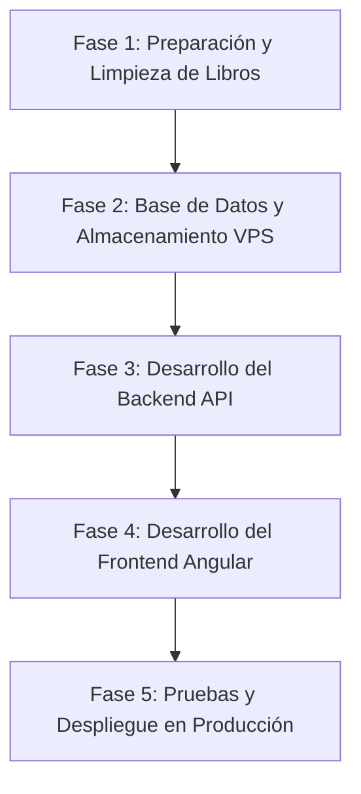
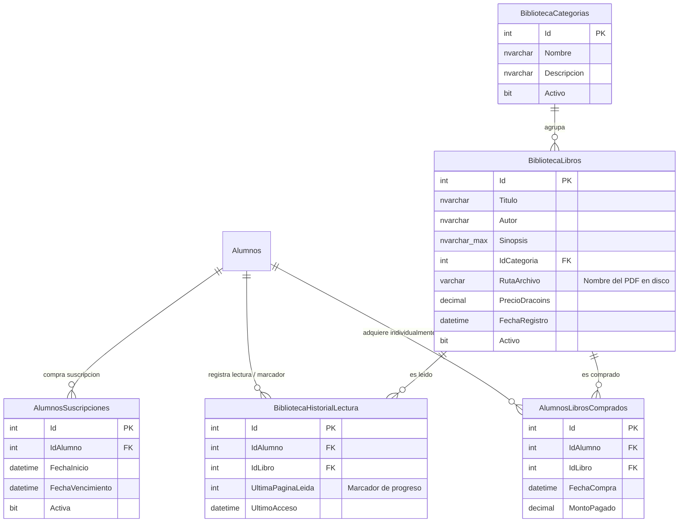

# Plan de Trabajo: Módulo de Biblioteca
## Proyecto: Imperius Draconis

Este documento detalla el plan estratégico y técnico para la integración del nuevo módulo de **Biblioteca** en la plataforma Imperius Draconis. El módulo permitirá a los alumnos adquirir libros individualmente o acceder a ellos mediante una suscripción semanal recurrente, utilizando **Dracoins (DCs)** registrados en la tabla tradicional de transacciones de la plataforma.

---

## 🗺️ Mapa de Ruta del Proyecto

El proyecto se dividirá en 5 fases lógicas secuenciales, desde la preparación de datos hasta el despliegue final en producción.

---

## 📅 Cronograma y Distribución de Fases

### 📁 Fase 1: Limpieza de Archivos y Preparación de Datos (Fase de Datos)
*Esta fase se enfoca en verificar la integridad de los ~700 libros restantes, homologar sus nombres de archivo y consolidar la metadata junto a los 400 libros ya validados en el Excel `GELATINA - LIBROS POR LIMPIAR.xlsx`.*

1. **Auditoría e Integridad Física de Archivos:**
   * Desarrollar un script local (Python) para verificar que los ~1100 libros abran correctamente y no presenten corrupción (PDFs y EPUBs legibles).
   * Identificar y listar archivos dañados o rotos para su posterior sustitución o exclusión.
2. **Normalización de Archivos Físicos:**
   * Renombrar masivamente todos los archivos de libros a una estructura limpia y segura para almacenamiento web (por ejemplo, `autor_titulo_id.pdf` en minúsculas, reemplazando espacios por guiones bajos y eliminando tildes y caracteres especiales).
3. **Consolidación de Metadata:**
   * Analizar el archivo de Excel `GELATINA - LIBROS POR LIMPIAR.xlsx` para heredar su formato y campos (ID, Título, Autor, Sinopsis, Categoría, Nombre del Archivo, Formato).
   * Usar herramientas automatizadas de extracción de metadatos (lectura de las primeras páginas de PDFs/EPUBs) para rellenar la metadata de los ~700 libros restantes.
   * Diseñar una interfaz o flujo CSV rápido para la corrección manual de campos faltantes o incorrectos.
4. **Generación del Entregable de Carga:**
   * Consolidar la información en un archivo único limpio (`biblioteca_catalogo_completo.csv` o similar) con la información unificada de los 1100 libros.

---

### 🗄️ Fase 2: Diseño de Base de Datos y Persistencia de Archivos
*Definición y aplicación del esquema de base de datos en SQL Server y del sistema de almacenamiento de archivos pesados en el VPS.*

#### Esquema de Base de Datos Propuesto (SQL Server)

1. **Script de Migración (`SQLMigrar/012_create_biblioteca_tables.sql`):**
   * Creación de las 5 tablas descritas arriba utilizando tipos de datos óptimos y restricciones de clave externa (*Foreign Keys*).
2. **Estrategia de Persistencia de Archivos en el VPS (Coolify):**
   * Configurar un volumen persistente compartido en Coolify apuntando a `/app/wwwroot/Content/Biblioteca` para evitar que la reconstrucción del contenedor de la API borre los archivos PDF subidos.
3. **Poblamiento Inicial (Seeding):**
   * Crear un procedimiento o script de inserción en SQL para volcar los 1100 libros del CSV unificado directamente a las tablas `BibliotecaCategorias` y `BibliotecaLibros`.

---

### 🔌 Fase 3: Desarrollo del Backend API (C# .NET Core)
*Creación de la lógica de negocio, endpoints transaccionales (compra de libros y suscripciones semanales por Dracoins), control de marcadores de progreso y entrega segura de archivos PDF/EPUB.*

1. **Modelos y DTOs:**
   * Crear clases representativas físicas y DTOs específicos (`LibroDto`, `CategoriaDto`, `CompraRequestDto`, `ProgresoLecturaDto`).
2. **Servicio Transaccional de Biblioteca (`BibliotecaService.cs`):**
   * **Compra Individual:** Ejecutar una transacción SQL que verifique el saldo del alumno, reste los Dracoins necesarios, registre la compra en `AlumnosLibrosComprados` e inserte la operación en el historial general de transacciones (`MovimientosDracoins`).
   * **Suscripción Semanal:** Lógica para que los alumnos compren la suscripción semanal. Al activarse, se descuenta el monto de `MovimientosDracoins` y se actualiza `AlumnosSuscripciones`.
   * **Cobro Semanal Recurrente (Automático):** Desarrollar un servicio de cobro masivo semanal en el backend similar al de las mascotas (`ProcessWeeklyChargesAsync`), de forma que reste automáticamente los Dracoins correspondientes de forma recurrente y extienda la validez en `AlumnosSuscripciones`.
   * **Guardar Progreso de Lectura:** Registrar e ir actualizando (Upsert) la página exacta en la que se queda el estudiante mediante la tabla `BibliotecaHistorialLectura`.
   * **Validación de Acceso:** Lógica que determine si un alumno específico tiene permiso para ver un libro (porque lo compró individualmente o posee la suscripción semanal activa).
3. **Endpoints de Alumno (`BibliotecaController.cs`):**
   * `GET /api/biblioteca/libros` (Catálogo con paginación, filtros por categoría y búsqueda).
   * `GET /api/biblioteca/libros/{id}` (Detalle del libro, estado de adquisición y última página leída).
   * `POST /api/biblioteca/libros/{id}/comprar` (Iniciar compra del libro por Dracoins).
   * `POST /api/biblioteca/suscripcion/adquirir` (Comprar suscripción semanal).
   * `POST /api/biblioteca/libros/{id}/progreso` (Guardar progreso actualizando `UltimaPaginaLeida`).
   * `GET /api/biblioteca/libros/{id}/leer` (Descarga segura: Valida acceso del alumno y retorna un `FileStreamResult` del PDF. Impide el acceso directo al archivo en el sistema de archivos mediante URL externa).
4. **Endpoints Administrativos (`BibliotecaAdminController.cs`):**
   * CRUD completo para Categorías y Libros.
   * Endpoint de carga de archivos que reciba el PDF/EPUB y lo guarde en el volumen persistente del servidor.
   * Endpoint de cobro semanal recurrente de suscripción (`POST /api/biblioteca/suscripcion/cobro-semanal`).
5. **Manejo de Roles:**
   * Proteger el CRUD administrativo mediante el atributo de autorización personalizado `[HasPermission("Biblioteca:Administrar")]`.

---

### 🎨 Fase 4: Desarrollo del Frontend (Angular)
*Construcción de los componentes visuales para los alumnos (lectura, marcadores de progreso, catálogo, suscripción) y los administradores (formularios CRUD, carga de archivos).*

1. **Servicio Angular (`biblioteca.service.ts`):**
   * Conectar con todos los endpoints de la API (catálogo, compras, actualización de progreso y flujos administrativos).
2. **Vistas para los Alumnos (Área de Biblioteca):**
   * **Catálogo Principal:** Interfaz moderna (vista de cuadrícula de portadas) con buscador en tiempo real, filtros por categoría y ordenamiento.
   * **Ficha de Detalle de Libro:** Modal o vista lateral que muestre la metadata (título, autor, sinopsis) y el estado (precio, botón de "Leer" o "Comprar"). Si ya tiene lectura iniciada, mostrar una barra de progreso visual y el botón "Continuar leyendo (Pág. X)".
   * **Visor de PDF Integrado con Historial:** Visualizador PDF que, al cargar el libro, salte automáticamente a la `UltimaPaginaLeida` guardada. A medida que el alumno cambie de página, el visor enviará el progreso al backend (usando técnicas de *debounce* para no saturar la red con peticiones redundantes).
   * **Panel de Suscripción:** Banner dinámico que indique si el alumno tiene la suscripción semanal activa o le permita activarla con un clic.
3. **Vistas para Administradores (Área de Gestión):**
   * **Gestor de Biblioteca:** Listado tabular de libros con capacidad de edición, desactivación lógica y filtrado.
   * **Formulario de Libro/Categoría:** Campos de metadatos detallados y control de arrastre de archivos para subir los PDFs del libro.
4. **Protección de Rutas (Guards):**
   * Incorporar guards basados en permisos para restringir las rutas de administración de biblioteca.

---

### 🚀 Fase 5: Pruebas, Optimización y Lanzamiento
*Garantizar la estabilidad y seguridad económica antes de liberar la funcionalidad a la comunidad.*

1. **Pruebas de Integración y Transaccionalidad:**
   * Asegurar mediante pruebas unitarias que ante una desconexión o fallo en base de datos a mitad de una compra, se realice un rollback completo (evitando saldos negativos o movimientos inconsistentes en `MovimientosDracoins`).
2. **Pruebas de Rendimiento de Descarga:**
   * Verificar que la API sirva los PDFs grandes por partes (*chunks/streaming*) para evitar que múltiples alumnos descargando libros simultáneamente saturen la memoria RAM del VPS de Oracle.
3. **Subida de Archivos y Sincronización:**
   * Sincronizar por SFTP/rsync la carpeta de los 1100 libros limpios directamente al volumen persistente de Coolify en producción.
4. **Migración en Producción:**
   * Ejecutar el script SQL definitivo en el SQL Server de SmartASP.
5. **Despliegue e Inicio:**
   * Desplegar las imágenes de la API y el Frontend a través de Coolify, activar la característica y validar con un usuario de prueba beta.

---

## 🔒 Matriz de Seguridad y Reglas de Negocio

> [!IMPORTANT]
> **Reglas críticas a implementar en el desarrollo:**
> 1. Un alumno inactivo **no puede** realizar compras de libros ni suscripciones.
> 2. Los montos de compra y costos de suscripción deben ser **enteros positivos**, registrándose con signo negativo (`-Monto`) en `MovimientosDracoins` con el formato: `VALUES (@CodigoRemitente, 'COBRO_BIBLIOTECA', @Monto, GETDATE(), @Observacion)`.
> 3. Los PDFs no deben estar expuestos en un subdirectorio público estático (`/wwwroot/libros/libro.pdf`). **Deben ser servidos obligatoriamente a través del controlador de la API** que realiza la verificación de autorización previa a entregar los bytes.
> 4. Si el alumno tiene la suscripción semanal activa, la descarga/lectura debe retornar éxito inmediatamente, sin verificar compras de libros individuales.
