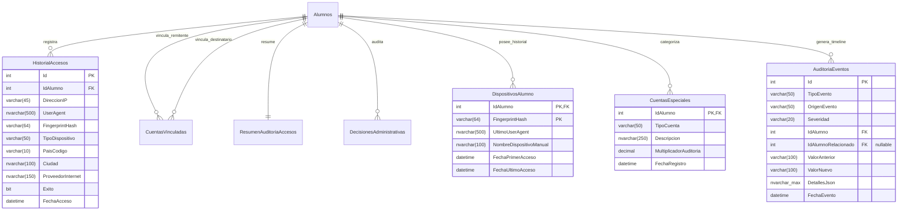
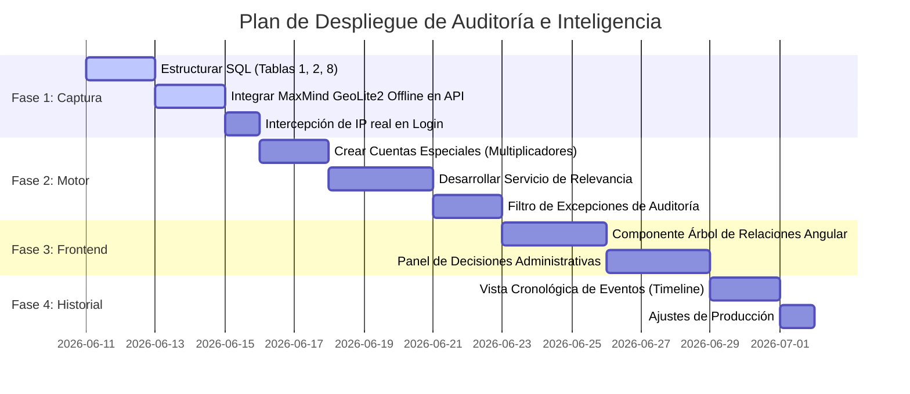

# Especificación Técnica Consolidada: Sistema de Inteligencia y Auditoría de Accesos

Este documento presenta la especificación técnica definitiva y la revisión de arquitectura para la herramienta de **Auditoría e Inteligencia de Accesos** de **Imperius Draconis**, optimizada para una comunidad de **50 a 500 usuarios activos**. El diseño está orientado a proveer herramientas de investigación para administradores humanos, sin implementar bloqueos automáticos de ningún tipo.

---

## 1. Concepto y Terminología Operativa

Para alinearse con un ambiente de comunidad y evitar juicios de valor automatizados, la plataforma adopta la siguiente terminología:

* **Relevancia de Auditoría** (Audit Relevance): Métrica numérica de 0 a 100 que refleja el nivel de coincidencias técnicas acumuladas.
* **Prioridad de Revisión** (Review Priority): Clasificación semántica del nivel de atención requerido para auditoría manual:
  * **0 a 39 (Baja)**: Comportamiento estándar.
  * **40 a 69 (Media)**: Revisar cuando sea conveniente (ej. patrones usuales de hermanos/aulas compartidas).
  * **70 a 89 (Alta)**: Investigar pronto.
  * **90 a 100 (Crítica)**: Revisión urgente (coincidencias múltiples de hardware y flujos inusuales).

---

## 2. Base de Datos Ampliada y Estructura SQL

Se define el esquema de base de datos definitivo en **SQL Server**. Se han incorporado los campos de `OrigenEvento` y `Severidad` a la tabla `AuditoriaEventos` para facilitar la trazabilidad histórica de los cambios y relaciones en el tiempo, y se optimiza la tabla de **Cuentas Especiales** reemplazando la exclusión binaria por un multiplicador de relevancia.



### Script SQL (`SQLMigrar/011_create_audit_intelligence_tables.sql`):
```sql
-- 1. Tabla de Historial de Accesos
CREATE TABLE dbo.HistorialAccesos (
    Id INT IDENTITY(1,1) PRIMARY KEY,
    IdAlumno INT NOT NULL FOREIGN KEY REFERENCES dbo.Alumnos(IdAlumno),
    DireccionIP VARCHAR(45) NOT NULL,
    UserAgent NVARCHAR(500) NULL,
    FingerprintHash VARCHAR(64) NOT NULL,
    TipoDispositivo VARCHAR(50) NOT NULL,
    PaisCodigo VARCHAR(10) NULL,
    Ciudad NVARCHAR(100) NULL,
    ProveedorInternet NVARCHAR(150) NULL,
    Exito BIT NOT NULL,
    FechaAcceso DATETIME DEFAULT GETDATE()
);

CREATE NONCLUSTERED INDEX IX_HistorialAccesos_IP ON dbo.HistorialAccesos(DireccionIP) INCLUDE (IdAlumno);
CREATE NONCLUSTERED INDEX IX_HistorialAccesos_Fingerprint ON dbo.HistorialAccesos(FingerprintHash) INCLUDE (IdAlumno);
CREATE NONCLUSTERED INDEX IX_HistorialAccesos_Alumno_Fecha ON dbo.HistorialAccesos(IdAlumno, FechaAcceso DESC);

-- 2. Historial de Dispositivos por Alumno
CREATE TABLE dbo.DispositivosAlumno (
    IdAlumno INT NOT NULL FOREIGN KEY REFERENCES dbo.Alumnos(IdAlumno),
    FingerprintHash VARCHAR(64) NOT NULL,
    UltimoUserAgent NVARCHAR(500) NULL,
    NombreDispositivoManual NVARCHAR(100) NULL,
    FechaPrimerAcceso DATETIME DEFAULT GETDATE(),
    FechaUltimoAcceso DATETIME DEFAULT GETDATE(),
    CONSTRAINT PK_DispositivosAlumno PRIMARY KEY (IdAlumno, FingerprintHash)
);

-- 3. Cuentas Especiales (Multiplicador de Relevancia en lugar de Exclusión Completa)
CREATE TABLE dbo.CuentasEspeciales (
    IdAlumno INT PRIMARY KEY FOREIGN KEY REFERENCES dbo.Alumnos(IdAlumno),
    TipoCuenta VARCHAR(50) NOT NULL,              -- CASA, COMPARTIDA_AUTORIZADA, ASISTENTE, INSTITUCIONAL, ADMINISTRATIVA
    Descripcion NVARCHAR(250) NULL,
    MultiplicadorAuditoria DECIMAL(3,2) NOT NULL DEFAULT 1.00, -- Multiplica el score final (ej. 0.25 para Casa)
    FechaRegistro DATETIME DEFAULT GETDATE()
);

-- 4. Excepciones Permanentes
CREATE TABLE dbo.ExcepcionesAuditoria (
    Id INT IDENTITY(1,1) PRIMARY KEY,
    TipoExcepcion VARCHAR(50) NOT NULL,           -- RELACION_AUTORIZADA, IP_CONFIABLE, DISPOSITIVO_AUTORIZADO
    ValorA VARCHAR(100) NOT NULL,
    ValorB VARCHAR(100) NULL,
    Motivo NVARCHAR(500) NULL,
    FechaCreado DATETIME DEFAULT GETDATE(),
    IdAdministrador INT NOT NULL,
    Activa BIT NOT NULL DEFAULT 1
);

-- 5. Vinculaciones Implícitas
CREATE TABLE dbo.CuentasVinculadas (
    Id INT IDENTITY(1,1) PRIMARY KEY,
    IdAlumnoA INT NOT NULL FOREIGN KEY REFERENCES dbo.Alumnos(IdAlumno),
    IdAlumnoB INT NOT NULL FOREIGN KEY REFERENCES dbo.Alumnos(IdAlumno),
    TipoEvidencia VARCHAR(30) NOT NULL,
    FuerzaVinculo INT NOT NULL DEFAULT 1,
    CreadoEn DATETIME DEFAULT GETDATE(),
    ActualizadoEn DATETIME DEFAULT GETDATE(),
    CONSTRAINT CK_CuentasVinculadas_NoAutoreferencial CHECK (IdAlumnoA < IdAlumnoB),
    CONSTRAINT UQ_CuentasVinculadas_Alumnos_Evidencia UNIQUE (IdAlumnoA, IdAlumnoB, TipoEvidencia)
);

-- 6. Resumen de Inteligencia y Auditoría
CREATE TABLE dbo.ResumenAuditoriaAccesos (
    IdAlumno INT PRIMARY KEY FOREIGN KEY REFERENCES dbo.Alumnos(IdAlumno),
    RelevanciaAuditoria INT NOT NULL DEFAULT 0,
    MotivosDetalle NVARCHAR(MAX) NOT NULL,
    EvidenciasJson NVARCHAR(MAX) NOT NULL,
    UltimaEvaluacion DATETIME NOT NULL DEFAULT GETDATE()
);

-- 7. Historial de Decisiones Administrativas Manuales
CREATE TABLE dbo.DecisionesAdministrativas (
    Id INT IDENTITY(1,1) PRIMARY KEY,
    IdAlumno INT NOT NULL FOREIGN KEY REFERENCES dbo.Alumnos(IdAlumno),
    IdAlumnoRelacionado INT NULL FOREIGN KEY REFERENCES dbo.Alumnos(IdAlumno),
    Decision VARCHAR(50) NOT NULL,                -- EN_OBSERVACION, PERMITIDA_FAMILIAR, SOSPECHOSA_CONFIRMADA, ACCION_MANUAL
    Motivo NVARCHAR(500) NULL,
    NotasInternas NVARCHAR(MAX) NULL,
    IdAdministrador INT NOT NULL,
    FechaDecision DATETIME DEFAULT GETDATE()
);

-- 8. Historial Cronológico de Eventos de Auditoría (Con Origen y Severidad)
CREATE TABLE dbo.AuditoriaEventos (
    Id INT IDENTITY(1,1) PRIMARY KEY,
    TipoEvento VARCHAR(50) NOT NULL,              -- DISPOSITIVO_NUEVO, VINCULO_NUEVO, CAMBIO_RELEVANCIA, EXCEPCION_CREADA, CUENTA_ESPECIAL_REGISTRADA
    OrigenEvento VARCHAR(50) NOT NULL,            -- SISTEMA, LOGIN, TRANSFERENCIA, AUDITORIA, ADMINISTRADOR, EXCEPCION, CUENTA_ESPECIAL
    Severidad VARCHAR(20) NOT NULL,               -- INFO, LOW, MEDIUM, HIGH, CRITICAL
    IdAlumno INT NOT NULL FOREIGN KEY REFERENCES dbo.Alumnos(IdAlumno),
    IdAlumnoRelacionado INT NULL FOREIGN KEY REFERENCES dbo.Alumnos(IdAlumno),
    ValorAnterior VARCHAR(100) NULL,
    ValorNuevo VARCHAR(100) NULL,
    DetallesJson NVARCHAR(MAX) NULL,              -- JSON con detalles técnicos adicionales
    FechaEvento DATETIME DEFAULT GETDATE()
);

CREATE NONCLUSTERED INDEX IX_AuditoriaEventos_Alumno_Fecha ON dbo.AuditoriaEventos(IdAlumno, FechaEvento DESC);
CREATE NONCLUSTERED INDEX IX_AuditoriaEventos_Tipo ON dbo.AuditoriaEventos(TipoEvento);
CREATE NONCLUSTERED INDEX IX_AuditoriaEventos_Severidad ON dbo.AuditoriaEventos(Severidad);
```

---

## 3. Cuentas Especiales y Atenuación de Relevancia (Multiplicador)

Para evitar puntos ciegos de seguridad en cuentas con accesos compartidos legítimos, el sistema implementa un **Multiplicador de Relevancia** (`MultiplicadorAuditoria`). La relevancia calculada se pondera de la siguiente manera:

* **Cuenta Normal**: Multiplicador = `1.00`.
* **Cuenta de Asistente**: Multiplicador = `0.50` (Reduce a la mitad el peso de compartir hardware).
* **Cuenta de la Casa (Ravenclaw, etc.)**: Multiplicador = `0.25` (Atenúa en un 75% las alertas comunes).
* **Cuenta Administrativa**: Multiplicador = `0.10` (Ignora detalles de rutina, pero si detecta anomalías severas como transferencias masivas de Dracoins, la relevancia aumentará y se listará en el panel).

---

## 4. Backend (C# Entities & Services)

### C# Entities (`Models/Game/Auditoria/`)

* **AuditoriaEvento.cs**:
```csharp
using System;

namespace ImperiusDraconisAPI.Models.Auditoria
{
    public class AuditoriaEvento
    {
        public int Id { get; set; }
        public string TipoEvento { get; set; } = string.Empty; // DISPOSITIVO_NUEVO, VINCULO_NUEVO, CAMBIO_RELEVANCIA
        public string OrigenEvento { get; set; } = string.Empty; // SISTEMA, LOGIN, ADMINISTRADOR
        public string Severidad { get; set; } = string.Empty; // INFO, LOW, MEDIUM, HIGH, CRITICAL
        public int IdAlumno { get; set; }
        public int? IdAlumnoRelacionado { get; set; }
        public string? ValorAnterior { get; set; }
        public string? ValorNuevo { get; set; }
        public string? DetallesJson { get; set; }
        public DateTime FechaEvento { get; set; }
    }
}
```

### Servicio de Auditoría (`Services/Auditoria/AuditoriaService.cs`)
Implementación de lógica con registro de eventos automatizados en base de datos.

```csharp
using System;
using System.Collections.Generic;
using System.Data;
using System.Text.Json;
using System.Threading.Tasks;
using Microsoft.Data.SqlClient;
using Microsoft.Extensions.Configuration;
using ImperiusDraconisAPI.Models.Auditoria;
using ImperiusDraconisAPI.Models.Auditoria.Dtos;

namespace ImperiusDraconisAPI.Services.Auditoria
{
    public class AuditoriaService : IAuditoriaService
    {
        private readonly string _connectionString;
        private readonly IGeoLocationService _geoLocationService;

        public AuditoriaService(IConfiguration configuration, IGeoLocationService geoLocationService)
        {
            _connectionString = configuration.GetConnectionString("DefaultConnection") 
                ?? throw new ArgumentNullException(nameof(configuration));
            _geoLocationService = geoLocationService;
        }

        public async Task RegistrarAccesoAsync(int idAlumno, string ip, string userAgent, string fingerprint, bool exito)
        {
            string dispositivo = ParsearDispositivo(userAgent);
            var (pais, ciudad, isp) = _geoLocationService.ObtenerMetadatosIp(ip);

            using var conn = new SqlConnection(_connectionString);
            await conn.OpenAsync();

            // 1. Guardar Acceso
            using (var cmdAcceso = new SqlCommand(@"
                INSERT INTO dbo.HistorialAccesos 
                (IdAlumno, DireccionIP, UserAgent, FingerprintHash, TipoDispositivo, PaisCodigo, Ciudad, ProveedorInternet, Exito, FechaAcceso) 
                VALUES 
                (@IdAlumno, @IP, @UA, @FP, @Dispositivo, @Pais, @Ciudad, @ISP, @Exito, GETDATE())", conn))
            {
                cmdAcceso.Parameters.AddWithValue("@IdAlumno", idAlumno);
                cmdAcceso.Parameters.AddWithValue("@IP", ip);
                cmdAcceso.Parameters.AddWithValue("@UA", (object)userAgent ?? DBNull.Value);
                cmdAcceso.Parameters.AddWithValue("@FP", fingerprint);
                cmdAcceso.Parameters.AddWithValue("@Dispositivo", dispositivo);
                cmdAcceso.Parameters.AddWithValue("@Pais", (object)pais ?? DBNull.Value);
                cmdAcceso.Parameters.AddWithValue("@Ciudad", (object)ciudad ?? DBNull.Value);
                cmdAcceso.Parameters.AddWithValue("@ISP", (object)isp ?? DBNull.Value);
                cmdAcceso.Parameters.AddWithValue("@Exito", exito);
                await cmdAcceso.ExecuteNonQueryAsync();
            }

            if (exito)
            {
                // 2. Controlar Aparición de Nuevo Dispositivo (Fingerprint)
                bool esNuevoDispositivo = false;
                using (var cmdCheck = new SqlCommand("SELECT COUNT(*) FROM dbo.DispositivosAlumno WHERE IdAlumno = @Id AND FingerprintHash = @FP", conn))
                {
                    cmdCheck.Parameters.AddWithValue("@Id", idAlumno);
                    cmdCheck.Parameters.AddWithValue("@FP", fingerprint);
                    esNuevoDispositivo = Convert.ToInt32(await cmdCheck.ExecuteScalarAsync()) == 0;
                }

                if (esNuevoDispositivo)
                {
                    // Loggear evento
                    using (var cmdLogEv = new SqlCommand(@"
                        INSERT INTO dbo.AuditoriaEventos (TipoEvento, OrigenEvento, Severidad, IdAlumno, ValorNuevo, FechaEvento)
                        VALUES ('DISPOSITIVO_NUEVO', 'LOGIN', 'INFO', @Id, @FP, GETDATE())", conn))
                    {
                        cmdLogEv.Parameters.AddWithValue("@Id", idAlumno);
                        cmdLogEv.Parameters.AddWithValue("@FP", fingerprint);
                        await cmdLogEv.ExecuteNonQueryAsync();
                    }
                }

                // 3. Upsert Dispositivo
                using (var cmdMergeDisp = new SqlCommand(@"
                    MERGE dbo.DispositivosAlumno AS Target
                    USING (SELECT @IdAlumno AS Id, @FP AS Hash, @UA AS Agent) AS Source
                    ON (Target.IdAlumno = Source.Id AND Target.FingerprintHash = Source.Hash)
                    WHEN MATCHED THEN
                        UPDATE SET UltimoUserAgent = Source.Agent, FechaUltimoAcceso = GETDATE()
                    WHEN NOT MATCHED THEN
                        INSERT (IdAlumno, FingerprintHash, UltimoUserAgent, FechaPrimerAcceso, FechaUltimoAcceso)
                        VALUES (Source.Id, Source.Hash, Source.Agent, GETDATE(), GETDATE());", conn))
                {
                    cmdMergeDisp.Parameters.AddWithValue("@IdAlumno", idAlumno);
                    cmdMergeDisp.Parameters.AddWithValue("@FP", fingerprint);
                    cmdMergeDisp.Parameters.AddWithValue("@UA", (object)userAgent ?? DBNull.Value);
                    await cmdMergeDisp.ExecuteNonQueryAsync();
                }

                // 4. Procesar Vínculos y Auditoría
                await ProcesarVinculosDeCuentasAsync(idAlumno, fingerprint, ip, conn);
                await EvaluarAuditoriaInternaAsync(idAlumno, conn);
            }
        }

        public async Task RegistrarExcepcionAsync(ExcepcionAuditoria excepcion)
        {
            using var conn = new SqlConnection(_connectionString);
            await conn.OpenAsync();

            using (var cmd = new SqlCommand(@"
                INSERT INTO dbo.ExcepcionesAuditoria 
                (TipoExcepcion, ValorA, ValorB, Motivo, FechaCreado, IdAdministrador, Activa) 
                VALUES 
                (@Tipo, @ValA, @ValB, @Motivo, GETDATE(), @IdAdmin, 1)", conn))
            {
                cmd.Parameters.AddWithValue("@Tipo", excepcion.TipoExcepcion);
                cmd.Parameters.AddWithValue("@ValA", excepcion.ValorA);
                cmd.Parameters.AddWithValue("@ValB", (object)excepcion.ValorB ?? DBNull.Value);
                cmd.Parameters.AddWithValue("@Motivo", (object)excepcion.Motivo ?? DBNull.Value);
                cmd.Parameters.AddWithValue("@IdAdmin", excepcion.IdAdministrador);
                await cmd.ExecuteNonQueryAsync();
            }

            // Registrar Evento
            using (var cmdEvent = new SqlCommand(@"
                INSERT INTO dbo.AuditoriaEventos (TipoEvento, OrigenEvento, Severidad, IdAlumno, ValorNuevo, DetallesJson, FechaEvento)
                VALUES ('EXCEPCION_CREADA', 'ADMINISTRADOR', 'LOW', @Id, @Tipo, @Detalles, GETDATE())", conn))
            {
                cmdEvent.Parameters.AddWithValue("@Id", int.Parse(excepcion.ValorA));
                cmdEvent.Parameters.AddWithValue("@Tipo", excepcion.TipoExcepcion);
                cmdEvent.Parameters.AddWithValue("@Detalles", JsonSerializer.Serialize(excepcion));
                await cmdEvent.ExecuteNonQueryAsync();
            }

            await EvaluarAuditoriaInternaAsync(int.Parse(excepcion.ValorA), conn);
        }

        public async Task<RelacionAccesoNodoDto> ObtenerArbolRelacionesAsync(int idAlumno)
        {
            var raiz = new RelacionAccesoNodoDto();

            using var conn = new SqlConnection(_connectionString);
            await conn.OpenAsync();

            using (var cmdName = new SqlCommand("SELECT Nombre FROM dbo.Alumnos WHERE IdAlumno = @Id", conn))
            {
                cmdName.Parameters.AddWithValue("@Id", idAlumno);
                string nombre = Convert.ToString(await cmdName.ExecuteScalarAsync()) ?? $"Alumno #{idAlumno}";
                raiz.Label = nombre;
                raiz.Tipo = "ALUMNO";
                raiz.Valor = idAlumno.ToString();
            }

            // Ramas de Dispositivos
            var nodoDispositivos = new RelacionAccesoNodoDto { Label = "Dispositivos Registrados", Tipo = "GRUPO" };
            using (var cmdDev = new SqlCommand(@"
                SELECT FingerprintHash, NombreDispositivoManual 
                FROM dbo.DispositivosAlumno 
                WHERE IdAlumno = @Id", conn))
            {
                cmdDev.Parameters.AddWithValue("@Id", idAlumno);
                using var reader = await cmdDev.ExecuteReaderAsync();
                while (await reader.ReadAsync())
                {
                    string hash = reader.GetString(0);
                    string alias = reader.IsDBNull(1) ? $"Huella {hash.Substring(0, 8)}" : reader.GetString(1);

                    nodoDispositivos.Hijos.Add(new RelacionAccesoNodoDto
                    {
                        Label = alias,
                        Tipo = "DISPOSITIVO",
                        Valor = hash
                    });
                }
            }
            if (nodoDispositivos.Hijos.Count > 0) raiz.Hijos.Add(nodoDispositivos);

            return raiz;
        }

        public async Task<ResumenAuditoriaAcceso?> ObtenerResumenAsync(int idAlumno)
        {
            using var conn = new SqlConnection(_connectionString);
            using var cmd = new SqlCommand(@"
                SELECT IdAlumno, RelevanciaAuditoria, MotivosDetalle, EvidenciasJson, UltimaEvaluacion 
                FROM dbo.ResumenAuditoriaAccesos 
                WHERE IdAlumno = @Id", conn);
            cmd.Parameters.AddWithValue("@Id", idAlumno);

            await conn.OpenAsync();
            using var reader = await cmd.ExecuteReaderAsync();
            if (await reader.ReadAsync())
            {
                return new ResumenAuditoriaAcceso
                {
                    IdAlumno = reader.GetInt32(0),
                    RelevanciaAuditoria = reader.GetInt32(1),
                    MotivosDetalle = reader.GetString(2),
                    EvidenciasJson = reader.GetString(3),
                    UltimaEvaluacion = reader.GetDateTime(4)
                };
            }
            return null;
        }

        public async Task EvaluarAuditoriaAlumnoAsync(int idAlumno)
        {
            using var conn = new SqlConnection(_connectionString);
            await conn.OpenAsync();
            await EvaluarAuditoriaInternaAsync(idAlumno, conn);
        }

        private async Task EvaluarAuditoriaInternaAsync(int idAlumno, SqlConnection conn)
        {
            decimal multiplicador = 1.00m;

            // 1. Obtener Multiplicador de Cuenta Especial
            using (var cmdEsp = new SqlCommand("SELECT MultiplicadorAuditoria FROM dbo.CuentasEspeciales WHERE IdAlumno = @Id", conn))
            {
                cmdEsp.Parameters.AddWithValue("@Id", idAlumno);
                object? res = await cmdEsp.ExecuteScalarAsync();
                if (res != null)
                {
                    multiplicador = Convert.ToDecimal(res);
                }
            }

            int scoreBruto = 0;
            var motivos = new List<string>();
            var evidencias = new Dictionary<string, object>();

            // 2. Validar Excepciones Permanentes
            using (var cmdExc = new SqlCommand(@"
                SELECT COUNT(*) FROM dbo.ExcepcionesAuditoria 
                WHERE Activa = 1 AND (
                    (TipoExcepcion = 'RELACION_AUTORIZADA' AND ((ValorA = @IdStr AND ValorB = @IdStr) OR (ValorA = @IdStr AND ValorB = @IdStr))) OR
                    (TipoExcepcion = 'DISPOSITIVO_AUTORIZADO' AND ValorA IN (SELECT FingerprintHash FROM dbo.DispositivosAlumno WHERE IdAlumno = @IdAlumno))
                )", conn))
            {
                cmdExc.Parameters.AddWithValue("@IdAlumno", idAlumno);
                cmdExc.Parameters.AddWithValue("@IdStr", idAlumno.ToString());
                int excepcionesActivas = Convert.ToInt32(await cmdExc.ExecuteScalarAsync());

                if (excepcionesActivas > 0)
                {
                    await GuardarResumenAuditoriaAsync(idAlumno, 10, "Excepción administrativa permanente activa.", "{}", conn);
                    return;
                }
            }

            // Regla A: Fingerprint compartido
            using (var cmdFp = new SqlCommand(@"
                SELECT COUNT(DISTINCT IdAlumno) FROM dbo.HistorialAccesos 
                WHERE FingerprintHash IN (
                    SELECT DISTINCT FingerprintHash FROM dbo.HistorialAccesos WHERE IdAlumno = @IdAlumno AND Exito = 1
                ) AND IdAlumno <> @IdAlumno AND Exito = 1", conn))
            {
                cmdFp.Parameters.AddWithValue("@IdAlumno", idAlumno);
                int cuentasFp = Convert.ToInt32(await cmdFp.ExecuteScalarAsync());
                if (cuentasFp > 0)
                {
                    scoreBruto += 40;
                    motivos.Add($"Comparte hardware con {cuentasFp} cuenta(s)");
                    evidencias.Add("HuellasCompartidas", cuentasFp);
                }
            }

            // Regla B: IP compartida
            using (var cmdIp = new SqlCommand(@"
                SELECT COUNT(DISTINCT IdAlumno) FROM dbo.HistorialAccesos 
                WHERE DireccionIP IN (
                    SELECT DISTINCT DireccionIP FROM dbo.HistorialAccesos WHERE IdAlumno = @IdAlumno AND Exito = 1
                ) AND IdAlumno <> @IdAlumno AND Exito = 1", conn))
            {
                cmdIp.Parameters.AddWithValue("@IdAlumno", idAlumno);
                int cuentasIp = Convert.ToInt32(await cmdIp.ExecuteScalarAsync());
                if (cuentasIp > 0)
                {
                    scoreBruto += 10;
                    motivos.Add($"Comparte dirección IP con {cuentasIp} cuenta(s)");
                    evidencias.Add("IpsCompartidas", cuentasIp);
                }
            }

            // 3. Aplicar Multiplicador de Cuenta Especial
            int scoreFinal = (int)Math.Round(scoreBruto * multiplicador);
            if (scoreFinal > 100) scoreFinal = 100;

            if (multiplicador < 1.00m)
            {
                motivos.Add($"Score atenuado por tipo de cuenta especial (Factor: {multiplicador})");
            }

            string motivosTxt = string.Join("; ", motivos);
            string jsonEvidencias = JsonSerializer.Serialize(evidencias);

            // 4. Rastrear cambios significativos en Relevancia
            int scoreAnterior = 0;
            using (var cmdPrev = new SqlCommand("SELECT RelevanciaAuditoria FROM dbo.ResumenAuditoriaAccesos WHERE IdAlumno = @Id", conn))
            {
                cmdPrev.Parameters.AddWithValue("@Id", idAlumno);
                object? val = await cmdPrev.ExecuteScalarAsync();
                if (val != null) scoreAnterior = Convert.ToInt32(val);
            }

            if (Math.Abs(scoreFinal - scoreAnterior) >= 20)
            {
                string severidad = "INFO";
                if (scoreFinal >= 70) severidad = "HIGH";
                if (scoreFinal >= 90) severidad = "CRITICAL";

                // Registrar evento de cambio de relevancia
                using (var cmdLogEv = new SqlCommand(@"
                    INSERT INTO dbo.AuditoriaEventos (TipoEvento, OrigenEvento, Severidad, IdAlumno, ValorAnterior, ValorNuevo, FechaEvento)
                    VALUES ('CAMBIO_RELEVANCIA', 'SISTEMA', @Sev, @Id, @Prev, @New, GETDATE())", conn))
                {
                    cmdLogEv.Parameters.AddWithValue("@Id", idAlumno);
                    cmdLogEv.Parameters.AddWithValue("@Sev", severidad);
                    cmdLogEv.Parameters.AddWithValue("@Prev", scoreAnterior.ToString());
                    cmdLogEv.Parameters.AddWithValue("@New", scoreFinal.ToString());
                    await cmdLogEv.ExecuteNonQueryAsync();
                }
            }

            await GuardarResumenAuditoriaAsync(idAlumno, scoreFinal, motivosTxt, jsonEvidencias, conn);
        }

        private async Task GuardarResumenAuditoriaAsync(int idAlumno, int score, string motivos, string evidencias, SqlConnection conn)
        {
            using var cmd = new SqlCommand(@"
                MERGE dbo.ResumenAuditoriaAccesos AS Target
                USING (SELECT @IdAlumno AS Id, @Score AS Score, @Motivos AS Motivos, @Evidencias AS Evidencias) AS Source
                ON (Target.IdAlumno = Source.Id)
                WHEN MATCHED THEN
                    UPDATE SET RelevanciaAuditoria = Source.Score, MotivosDetalle = Source.Motivos, EvidenciasJson = Source.Evidencias, UltimaEvaluacion = GETDATE()
                WHEN NOT MATCHED THEN
                    INSERT (IdAlumno, RelevanciaAuditoria, MotivosDetalle, EvidenciasJson, UltimaEvaluacion)
                    VALUES (Source.Id, Source.Score, Source.Motivos, Source.Evidencias, GETDATE());", conn);

            cmd.Parameters.AddWithValue("@IdAlumno", idAlumno);
            cmd.Parameters.AddWithValue("@Score", score);
            cmd.Parameters.AddWithValue("@Motivos", motivos);
            cmd.Parameters.AddWithValue("@Evidencias", evidencias);

            await cmd.ExecuteNonQueryAsync();
        }

        private async Task ProcesarVinculosDeCuentasAsync(int idAlumno, string fingerprint, string ip, SqlConnection conn)
        {
            using var cmd = new SqlCommand(@"
                SELECT DISTINCT IdAlumno FROM dbo.HistorialAccesos 
                WHERE FingerprintHash = @FP AND IdAlumno <> @IdAlumno AND Exito = 1", conn);
            cmd.Parameters.AddWithValue("@FP", fingerprint);
            cmd.Parameters.AddWithValue("@IdAlumno", idAlumno);

            var rels = new List<int>();
            using (var r = await cmd.ExecuteReaderAsync()) { while (await r.ReadAsync()) rels.Add(r.GetInt32(0)); }

            foreach (var relId in rels)
            {
                int menor = Math.Min(idAlumno, relId);
                int mayor = Math.Max(idAlumno, relId);

                bool esNuevoVinculo = false;
                using (var cmdCheck = new SqlCommand("SELECT COUNT(*) FROM dbo.CuentasVinculadas WHERE IdAlumnoA = @Menor AND IdAlumnoB = @Mayor AND TipoEvidencia = 'FINGERPRINT_COMPARTIDA'", conn))
                {
                    cmdCheck.Parameters.AddWithValue("@Menor", menor);
                    cmdCheck.Parameters.AddWithValue("@Mayor", mayor);
                    esNuevoVinculo = Convert.ToInt32(await cmdCheck.ExecuteScalarAsync()) == 0;
                }

                if (esNuevoVinculo)
                {
                    using (var cmdLogEv = new SqlCommand(@"
                        INSERT INTO dbo.AuditoriaEventos (TipoEvento, OrigenEvento, Severidad, IdAlumno, IdAlumnoRelacionado, ValorNuevo, FechaEvento)
                        VALUES ('VINCULO_NUEVO', 'SISTEMA', 'HIGH', @IdA, @IdB, 'FINGERPRINT_COMPARTIDA', GETDATE())", conn))
                    {
                        cmdLogEv.Parameters.AddWithValue("@IdA", menor);
                        cmdLogEv.Parameters.AddWithValue("@IdB", mayor);
                        await cmdLogEv.ExecuteNonQueryAsync();
                    }
                }

                using var cmdMerge = new SqlCommand(@"
                    MERGE dbo.CuentasVinculadas AS Target
                    USING (SELECT @Menor AS IdA, @Mayor AS IdB, 'FINGERPRINT_COMPARTIDA' AS Tipo) AS Source
                    ON (Target.IdAlumnoA = Source.IdA AND Target.IdAlumnoB = Source.IdB AND Target.TipoEvidencia = Source.Tipo)
                    WHEN MATCHED THEN
                        UPDATE SET FuerzaVinculo = Target.FuerzaVinculo + 1, ActualizadoEn = GETDATE()
                    WHEN NOT MATCHED THEN
                        INSERT (IdAlumnoA, IdAlumnoB, TipoEvidencia, FuerzaVinculo, CreadoEn, ActualizadoEn)
                        VALUES (Source.IdA, Source.IdB, Source.Tipo, 1, GETDATE(), GETDATE());", conn);

                cmdMerge.Parameters.AddWithValue("@Menor", menor);
                cmdMerge.Parameters.AddWithValue("@Mayor", mayor);
                await cmdMerge.ExecuteNonQueryAsync();
            }
        }

        private string ParsearDispositivo(string userAgent)
        {
            if (string.IsNullOrEmpty(userAgent)) return "Desconocido";
            string ua = userAgent.ToLower();
            if (ua.Contains("mobile") || ua.Contains("android") || ua.Contains("iphone")) return "Mobile";
            if (ua.Contains("ipad") || ua.Contains("tablet")) return "Tablet";
            return "Desktop";
        }
    }
}
```

---

## 5. Decisiones de Interfaz en Angular (Árbol vs. Grafo)

### Análisis Comparativo para Imperius Draconis (50-500 usuarios activos):

| Aspecto | Árbol de Relaciones (Nivel 1) | Grafo Interactivo (Red de Nodos) |
|---|---|---|
| **Costo de Desarrollo** | **Muy Bajo (1-2 días)**. Utiliza listas anidadas estándar y CSS nativo de Angular. | **Alto (5-7 días)**. Requiere integrar librerías de terceros (`vis.js` o `D3.js`). |
| **Complejidad de Mantenimiento** | **Nulo**. No hay dependencias externas ni problemas de renderizado de Canvas. | **Moderado**. Riesgo de conflictos de compatibilidad al actualizar versiones de Angular. |
| **Utilidad para la Administración** | **Excelente**. Cubre el 90% de las necesidades mostrando con quién comparte red e IP de forma legible. | **Buena, pero no indispensable**. Aporta valor principalmente para redes complejas de decenas de cuentas vinculadas. |

### Decisión de Implementación Recomendada:
1. **Fase Inicial (Producción)**: Implementar la **Vista de Árbol de Relaciones de Nivel 1** integrada en el detalle de la ficha de auditoría. Permite al administrador ver de forma limpia y textual todos los dispositivos y cuentas relacionadas directamente.
2. **Futuras Versiones**: Evaluar un **Grafo Interactivo** en el Dashboard global únicamente si la comunidad supera los 500 alumnos y se detectan redes organizadas de transferencia secundaria de Dracoins.

---

## 6. Roadmap de Implementación por Fases

Este plan está estructurado para entregar valor incremental rápido y evitar refactorizaciones de código.



---

## 7. Validación Crítica (Evitando Sobreingeniería)

### Qué Simplificar o Eliminar de la Propuesta Anterior:
* **Eliminar Bloqueos por Código**: Se eliminó por completo el flag de bloqueo de transferencias automáticas.
* **Evitar Grafos Complejos**: No se añadirán librerías como D3.js en el MVP, se utilizará la vista de árbol recursiva nativa en Angular.

### Qué Agregar para Aportar Valor Real:
* **La Tabla de Eventos (`AuditoriaEventos`) con Origen y Severidad**: Es indispensable para responder la pregunta operativa *"¿Desde cuándo estas dos cuentas comparten la misma huella?"* y permite filtrar con precisión los eventos significativos (`HIGH` / `CRITICAL` originados por el `SISTEMA`) de las interacciones comunes.
* **El Historial de Dispositivos**: Permite nombrar y dar contexto de forma manual a los dispositivos habituales, disminuyendo falsos positivos en las revisiones futuras.

---

## 8. Dictamen Final de Arquitectura

La arquitectura técnica presentada en esta propuesta está madura, cumple con todas las restricciones del monolito, respeta el acceso nativo mediante ADO.NET y evita la sobreingeniería.

### Recomendación Final:
**Listo para desarrollo.**

Se recomienda comenzar inmediatamente con la **Fase 1: Infraestructura de Captura y Geolocalización**, que sienta las bases de datos de accesos (`HistorialAccesos`, `DispositivosAlumno`, `AuditoriaEventos`) y habilita la resolución local de IP mediante MaxMind sin alterar el flujo principal de login.
