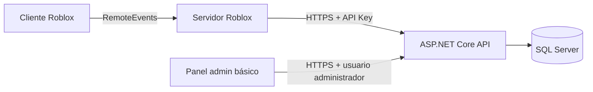
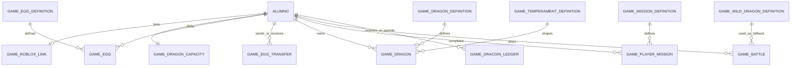

# Imperius Dragons

## Documento técnico MVP realista

**Versión:** 2.1

**Fecha:** 9 de junio de 2026

**Objetivo:** construir, probar y lanzar una primera versión divertida y mantenible
con una sola persona apoyada por IA.

**Tecnologías:** Roblox Studio, ASP.NET Core, SQL Server, Docker y Coolify.

---

## 1. Resumen ejecutivo

Imperius Dragons comenzará como un juego pequeño conectado al sistema Imperius
existente. El jugador vinculará su cuenta Roblox, comprará, regalará e incubará
huevos, cuidará un dragón acompañante, completará misiones y participará en combates
automáticos `1 vs 1` para ganar Dracoins y puntos de ranking.

La primera versión está diseñada para:

| Métrica | Objetivo |
|---|---:|
| Usuarios diarios | 20 a 100 |
| Jugadores concurrentes | 5 a 20 |
| Servidores Roblox simultáneos | 1 a 5 |
| Desarrolladores | 1 persona con ayuda de IA |

La arquitectura tendrá únicamente:

- Un juego en Roblox Studio.
- Una API ASP.NET Core.
- Una base de datos SQL Server.
- Un panel administrativo básico dentro de la API o del frontend existente.
- Docker y Coolify para desplegar.

No se usarán Redis, microservicios, workers separados, colas, Outbox Pattern,
matchmaking complejo, telemetría avanzada ni sistemas sofisticados de detección de
trampas en el MVP.

La prioridad es terminar el ciclo jugable completo:

`Vincular cuenta → comprar huevo → incubar → cuidar dragón → completar misión → combatir → recibir recompensa`

---

## 2. Alcances separados

### 2.1 Versión MVP

La primera versión incluye solamente:

1. Vinculación Roblox ↔ Imperius.
2. Compra de huevo usando Dracoins.
3. Incubación de huevo por tiempo.
4. Dragón visible como mascota acompañante.
5. Alimentación del dragón.
6. Hambre, felicidad y vida.
7. Crecimiento por tiempo y experiencia.
8. Misiones simples.
9. Combate automático `1 vs 1`.
10. Recompensas en Dracoins.
11. Ranking simple por puntos.
12. Panel administrativo básico para ajustar precios y recompensas.
13. Capacidad inicial de un dragón y compra de espacios adicionales.
14. Regalo de huevos entre jugadores.
15. Temperamentos simples asignados al nacer.
16. Dragones salvajes como rivales de respaldo.

### 2.2 Versión futura

Queda fuera del MVP:

- PvP en tiempo real.
- Mazmorras.
- Jefes.
- Guerras de casas.
- Crianza avanzada con genética.
- Trading general entre jugadores. Regalar huevos sí pertenece al MVP.
- Temporadas.
- Redis.
- Anticheat avanzado.
- Matchmaking complejo.
- Telemetría avanzada.

La crianza avanzada podrá añadirse después de validar que comprar, incubar y cuidar
dragones resulta divertido. No se deben diseñar genes, linajes o mutaciones antes de
esa validación.

---

## 3. Principios prácticos

- Construir primero el flujo jugable, no infraestructura futura.
- El cliente Roblox muestra información y solicita acciones.
- El servidor Roblox llama a la API; los LocalScripts nunca conocen la API Key.
- ASP.NET Core valida precios, recompensas, tiempos y propiedad.
- Toda modificación de Dracoins ocurre en backend y dentro de una transacción SQL.
- Compras y recompensas usan idempotencia para evitar cobros o premios duplicados.
- Regalar un huevo transfiere únicamente su propiedad y siempre deja historial.
- Los dragones nunca pueden transferirse entre jugadores.
- El combate automático se calcula en backend; Roblox solo presenta el resultado.
- Los valores de balance viven en tablas simples editables desde administración.
- Una caída temporal de la API bloquea acciones persistentes, pero no pierde Dracoins.
- Evitar abstracciones que no resuelvan un problema actual.

---

## 4. Arquitectura simplificada

### 4.1 Componentes



### 4.2 Responsabilidades

| Componente | Responsabilidad |
|---|---|
| Cliente Roblox | Interfaces, animaciones, mascota acompañante y presentación del combate |
| Servidor Roblox | Recibir solicitudes del cliente, aplicar rate limits básicos y consumir la API |
| ASP.NET Core API | Reglas de negocio, validación, Dracoins, misiones, combate y ranking |
| SQL Server | Fuente de verdad persistente |
| Panel admin | Editar configuraciones simples y consultar jugadores |

### 4.3 Backend

La API será un **monolito sencillo** organizado por funcionalidades:

```text
Controllers/
Services/
Models/
Data/
Security/
```

Se puede mantener el estilo actual de `ImperiusDraconisAPI`, usando
`Microsoft.Data.SqlClient` y servicios por funcionalidad. No hace falta introducir
microservicios, CQRS, event sourcing, buses de mensajes ni Domain-Driven Design
completo.

Servicios propuestos:

- `RobloxLinkService`
- `DragonService`, incluyendo huevos, espacios y necesidades
- `EggGiftService`
- `MissionService`
- `BattleService`
- `DracoinGameService`
- `GameAdminService`

### 4.4 Procesos por tiempo

No hace falta un Worker para incubación o crecimiento. Al consultar o actuar sobre un
huevo/dragón, la API calcula el estado actual usando fechas:

- Un huevo está listo si `HatchReadyAt <= ahora`.
- Un dragón crece si alcanzó tiempo y experiencia requeridos.
- Hambre, felicidad y vida se calculan desde su último valor guardado y
  `LastNeedsUpdateAt`.
- Si el cálculo lleva la vida a `0`, el dragón cambia a estado `Fled`.

Esto evita procesos en segundo plano y funciona bien para 100 usuarios diarios.

### 4.5 Lo que no se instala en MVP

- Redis.
- Cola de mensajes.
- Servicio Worker separado.
- OpenTelemetry o plataforma de trazas.
- Réplicas múltiples de API.
- Base de datos separada por módulo.
- Kubernetes.

---

## 5. Vinculación Roblox ↔ Imperius

### 5.1 Objetivo

Relacionar un `RobloxUserId` con un alumno/usuario existente de Imperius sin pedir la
contraseña de Imperius dentro de Roblox.

### 5.2 Flujo recomendado con código temporal

1. El usuario autenticado en Imperius solicita un código de vinculación.
2. Backend genera un código corto, de un solo uso, válido durante 10 minutos.
3. El jugador escribe ese código dentro del juego Roblox.
4. El servidor Roblox envía código y `RobloxUserId` a la API.
5. La API valida el código y crea el vínculo.
6. El código queda consumido y no puede reutilizarse.

Reglas:

- Un usuario Imperius solo puede estar vinculado a una cuenta Roblox.
- Una cuenta Roblox solo puede estar vinculada a un usuario Imperius.
- Desvincular requiere acción administrativa en el MVP.
- La API obtiene el `RobloxUserId` desde el servidor Roblox; nunca confía en uno enviado
  libremente por un LocalScript.

---

## 6. Base de datos mínima

### 6.1 Estrategia

Reutilizar la tabla existente `Alumnos` como identidad Imperius y saldo actual de
Dracoins. Crear pocas tablas nuevas con prefijo `Game` para evitar mezclar el juego con
las tablas existentes.

Si Dracoins también se modifican desde la aplicación Imperius actual, todos los
cambios deberán pasar por servicios que registren el movimiento. No debe existir una
actualización directa de `Alumnos.Dracoins` sin ledger.

### 6.2 Diagrama mínimo



### 6.3 Tablas

#### Tablas existentes reutilizadas

| Tabla | Uso |
|---|---|
| `Alumnos` | Identidad Imperius y saldo materializado en `Dracoins` |

#### Tablas nuevas

| Tabla | Campos principales | Propósito |
|---|---|---|
| `GameRobloxLinks` | `Id`, `IdAlumno`, `RobloxUserId`, `LinkedAt`, `Active` | Vinculación permanente |
| `GameLinkCodes` | `Id`, `IdAlumno`, `CodeHash`, `ExpiresAt`, `UsedAt` | Código temporal de un solo uso |
| `GameDragonCapacity` | `IdAlumno`, `PurchasedSlots`, `MaxCapacity`, `UpdatedAt`, `RowVersion` | Capacidad de dragones; inicia en 1 y máximo inicial 10 |
| `GameEggDefinitions` | `Id`, `Name`, `PriceDracoins`, `IncubationMinutes`, `DragonDefinitionId`, `DefaultRarity`, `Active` | Catálogo simple de huevos |
| `GameEggs` | `Id`, `IdAlumno`, `EggDefinitionId`, `Rarity`, `PurchasedAt`, `HatchReadyAt`, `Status`, `HatchedDragonId`, `RowVersion` | Huevos transferibles; conservan tipo y rareza |
| `GameEggTransfers` | `Id`, `EggId`, `FromAlumnoId`, `ToAlumnoId`, `Status`, `RequestedAt`, `ResolvedAt`, `IdempotencyKey` | Solicitud e historial mínimo de regalos |
| `GameDragonDefinitions` | `Id`, `Name`, `BaseLife`, `BaseAttack`, `BaseDefense`, `Active` | Tipos de dragón |
| `GameTemperamentDefinitions` | `Id`, `Name`, `AttackModifierPct`, `DefenseModifierPct`, `HungerDecayModifierPct`, `HappinessGainModifierPct`, `ExperienceModifierPct`, `BehaviorText`, `Active` | Personalidades con modificadores entre -5 % y +5 % |
| `GameDragons` | `Id`, `IdAlumno`, `DragonDefinitionId`, `TemperamentId`, `Rarity`, `Name`, `Stage`, `Level`, `Experience`, `Life`, `Happiness`, `Hunger`, `Status`, `LastNeedsUpdateAt`, `BornAt`, `Selected`, `RowVersion` | Dragones no transferibles |
| `GameFoodDefinitions` | `Id`, `Name`, `PriceDracoins`, `HungerGain`, `LifeGain`, `HappinessGain`, `ExperienceGain`, `Active` | Alimentos comprados al usarlos |
| `GameMissionDefinitions` | `Id`, `Code`, `Name`, `Type`, `Target`, `RewardDracoins`, `RewardExperience`, `Active` | Misiones configurables |
| `GamePlayerMissions` | `Id`, `IdAlumno`, `MissionDefinitionId`, `Progress`, `Status`, `AssignedDate`, `ClaimedAt` | Estado de misiones |
| `GameWildDragonDefinitions` | `Id`, `Name`, `Rarity`, `MinLevel`, `MaxLevel`, `BaseLife`, `BaseAttack`, `BaseDefense`, `Active` | Plantillas de dragones salvajes de respaldo |
| `GameBattles` | `Id`, `IdAlumno`, `PlayerDragonId`, `OpponentAlumnoId`, `OpponentDragonId`, `WildDragonDefinitionId`, `OpponentSnapshotJson`, `Result`, `RankingPoints`, `RewardDracoins`, `RewardExperience`, `CreatedAt`, `IdempotencyKey` | Duelo automático contra jugador o dragón salvaje |
| `GameDracoinLedger` | `Id`, `IdAlumno`, `Amount`, `BalanceAfter`, `Reason`, `ReferenceType`, `ReferenceId`, `IdempotencyKey`, `CreatedAt` | Historial económico simple |
| `GameSettings` | `Key`, `Value`, `UpdatedAt` | Balance editable desde admin |
| `GameIdempotency` | `Key`, `Operation`, `ResponseJson`, `CreatedAt` | Evitar repetir operaciones críticas |

### 6.4 Restricciones importantes

- Unique `GameRobloxLinks.RobloxUserId`.
- Unique `GameRobloxLinks.IdAlumno` cuando el vínculo está activo.
- Unique `GameIdempotency.Key`.
- Unique `GameBattles.IdempotencyKey`.
- Unique `GameEggTransfers.IdempotencyKey`.
- Solo una transferencia pendiente por huevo.
- `Alumnos.Dracoins >= 0`.
- `GameDragons.Life`, `Happiness` y `Hunger` entre `0` y `100`.
- `GameTemperamentDefinitions` limita cada modificador entre `-5` y `5`.
- `GameDragonCapacity.PurchasedSlots` entre `0` y `9`; capacidad total máxima `10`.
- Solo un dragón activo y no huido seleccionado por jugador.
- Un dragón con estado `Fled` no cuenta como ocupado y no puede combatir.
- Los dragones no tienen endpoint ni operación de transferencia.
- Índices sencillos por `IdAlumno`, `Status` y `Active`.

### 6.5 Capacidad derivada

No se guarda `SlotsDisponibles`, porque podría desincronizarse. Se calcula:

```text
SlotsComprados = GameDragonCapacity.PurchasedSlots
CapacidadMáxima = GameDragonCapacity.MaxCapacity
CapacidadTotal = mínimo(1 + SlotsComprados, CapacidadMáxima)
EspaciosOcupados = dragones no huidos + huevos sin abrir
SlotsDisponibles = máximo(0, CapacidadTotal - EspaciosOcupados)
```

Cada huevo sin abrir reserva un espacio. Por eso:

- Comprar un huevo exige al menos un espacio disponible.
- Aceptar un huevo regalado exige al menos un espacio disponible.
- Aceptar un regalo libera un espacio del remitente y ocupa uno del destinatario.
- Incubar reemplaza la reserva del huevo por el dragón y no consume un segundo espacio.
- Si un dragón huye, deja de ocupar espacio, pero su registro se conserva.

Al vincular por primera vez, la API crea `GameDragonCapacity` con
`PurchasedSlots = 0` y `MaxCapacity = 10`. Un precio inicial fácil de administrar es:

```text
PrecioSiguienteEspacio = PrecioBaseEspacio × (PurchasedSlots + 1)
```

`PrecioBaseEspacio` vive en `GameSettings`.

### 6.6 Ledger simple de Dracoins

No se necesita doble entrada completa en el MVP. Cada cambio:

1. Abre una transacción SQL.
2. Valida saldo y reglas.
3. Actualiza `Alumnos.Dracoins`.
4. Inserta una fila en `GameDracoinLedger` con saldo resultante.
5. Confirma la transacción.

Esto permite auditoría suficiente para una comunidad pequeña. Las compras y
recompensas deben incluir una idempotency key única.

---

## 7. APIs mínimas

### 7.1 Reglas

- Prefijo: `/api/game/v1`.
- Solo el servidor Roblox consume endpoints de juego.
- Autenticación mediante header `X-Game-Api-Key`.
- El panel usa la autenticación administrativa existente.
- Compras, regalos, incubaciones, claims y combates reciben `X-Idempotency-Key`.
- La API calcula precios y recompensas desde SQL.
- Errores simples: `{ code, message }`.

### 7.2 Vinculación y jugador

| Método | Ruta | Uso |
|---|---|---|
| `POST` | `/links/code` | Usuario Imperius genera código temporal |
| `POST` | `/links/consume` | Servidor Roblox vincula código con `RobloxUserId` |
| `GET` | `/players/by-roblox/{robloxUserId}` | Obtener resumen inicial |

El resumen inicial incluye saldo, capacidad total, espacios disponibles, huevos,
regalos pendientes, dragones, dragón seleccionado, misiones y posición de ranking.
Con pocos datos no hace falta separar el bootstrap en múltiples requests.

### 7.3 Huevos y dragones

| Método | Ruta | Uso |
|---|---|---|
| `GET` | `/eggs/catalog` | Ver huevos disponibles |
| `POST` | `/eggs/{eggDefinitionId}/purchase` | Comprar huevo |
| `POST` | `/eggs/{eggId}/hatch` | Incubar/abrir huevo listo |
| `POST` | `/eggs/{eggId}/gift` | Crear solicitud de regalo |
| `POST` | `/egg-gifts/{transferId}/accept` | Aceptar regalo y transferir propiedad |
| `POST` | `/egg-gifts/{transferId}/reject` | Rechazar regalo |
| `GET` | `/players/{robloxUserId}/egg-gifts` | Ver regalos pendientes y recientes |
| `GET` | `/eggs/{eggId}/transfers` | Consultar historial del huevo propio |
| `GET` | `/players/{robloxUserId}/dragons` | Listar dragones |
| `GET` | `/players/{robloxUserId}/dragon-capacity` | Consultar capacidad y espacios |
| `POST` | `/players/{robloxUserId}/dragon-capacity/purchase` | Comprar un espacio adicional |
| `POST` | `/dragons/{dragonId}/select` | Elegir mascota acompañante |
| `POST` | `/dragons/{dragonId}/feed/{foodDefinitionId}` | Comprar alimento y alimentar |

### 7.4 Misiones, combate y ranking

| Método | Ruta | Uso |
|---|---|---|
| `GET` | `/players/{robloxUserId}/missions` | Obtener misiones |
| `POST` | `/missions/{playerMissionId}/claim` | Reclamar recompensa |
| `POST` | `/battles/automatic` | Ejecutar combate automático |
| `GET` | `/players/{robloxUserId}/battles` | Historial reciente |
| `GET` | `/ranking?limit=50` | Ranking simple |

### 7.5 Administración

| Método | Ruta | Uso |
|---|---|---|
| `GET/PUT` | `/admin/game/settings` | Editar balance general |
| `GET/PUT` | `/admin/game/eggs` | Editar precio e incubación |
| `GET/PUT` | `/admin/game/foods` | Editar alimentos |
| `GET/PUT` | `/admin/game/missions` | Editar misiones y recompensas |
| `GET/PUT` | `/admin/game/temperaments` | Editar temperamentos dentro del límite ±5 % |
| `GET/PUT` | `/admin/game/wild-dragons` | Editar dragones salvajes |
| `GET` | `/admin/game/players/{idAlumno}` | Consultar estado del jugador |
| `POST` | `/admin/game/dracoins/adjustment` | Ajuste manual auditado |
| `POST` | `/admin/game/dragons/{dragonId}/restore` | Restaurar un dragón huido por soporte |

No crear un editor genérico de base de datos. El panel solo expone valores que sea
seguro modificar.

---

## 8. Sistemas del MVP

### 8.1 Huevos e incubación

- El catálogo define precio, tiempo de incubación, tipo y rareza inicial.
- Comprar valida espacio, descuenta Dracoins y crea el huevo en una transacción.
- `HatchReadyAt` determina cuándo puede abrirse.
- Incubar antes de tiempo devuelve error.
- Abrir un huevo crea exactamente un dragón, conserva rareza y asigna temperamento.
- Incubar vuelve a validar capacidad para protegerse frente a inconsistencias, pero el
  huevo ya debe tener su espacio reservado.
- En MVP el resultado puede ser fijo por tipo de huevo o usar una tabla de
  probabilidades sencilla calculada en backend.

Rarezas iniciales permitidas: `Common`, `Uncommon`, `Rare`, `Epic` y `Legendary`. La
rareza real se decide al comprar o crear el huevo, se guarda en `GameEggs.Rarity` y no
cambia al regalarlo. Al incubar se copia a `GameDragons.Rarity`. No hace falta una
tabla adicional de rarezas en el MVP.

### 8.2 Espacios para dragones

- Cada jugador comienza con `1` espacio gratuito.
- Puede comprar espacios adicionales con Dracoins.
- Máximo inicial: `10` espacios totales.
- El precio de cada espacio se obtiene de `GameSettings` y puede crecer por número de
  espacios comprados.
- Huevos sin abrir y dragones no huidos ocupan un espacio.
- Compra de huevo, recepción de regalo e incubación validan capacidad en backend.
- La compra de espacio y su cobro ocurren en una sola transacción idempotente.

Para mantener el MVP simple no existen establos secundarios ni almacenamiento
ilimitado.

### 8.3 Regalo de huevos

- Solo se pueden regalar huevos no abiertos.
- Los dragones nunca pueden transferirse.
- El huevo conserva `EggDefinitionId`, rareza y progreso de incubación.
- El destinatario debe tener cuenta vinculada.
- El remitente elige al destinatario mediante su código Imperius; la API resuelve el
  identificador interno y Roblox muestra confirmación antes de transferir.
- No se permite regalarse un huevo a uno mismo.
- Regalar crea una solicitud `Pending`; no cambia la propiedad inmediatamente.
- Mientras existe una solicitud pendiente, el huevo no puede abrirse ni ofrecerse de
  nuevo.
- Al aceptar, la API vuelve a validar espacio disponible, cambia propietario y marca
  la solicitud `Accepted` en una sola transacción.
- El destinatario puede rechazarla y dejarla como `Rejected`.
- El regalo no mueve Dracoins y no constituye trading.
- Solicitar, aceptar y rechazar son operaciones idempotentes.

### 8.4 Dragón acompañante

- Cada jugador puede seleccionar un dragón.
- Roblox recibe su definición y muestra el modelo acompañando al avatar.
- La posición, animación y seguimiento son visuales y viven en Roblox.
- Seleccionar otro dragón se guarda mediante API.
- Un dragón huido no puede seleccionarse.
- El dragón no modifica físicamente el mundo en MVP.

### 8.5 Hambre, felicidad, vida y huida

- Hambre, felicidad y vida usan una escala de `0` a `100`.
- Hambre disminuye siempre con el tiempo.
- Si hambre está por debajo del umbral configurado, felicidad disminuye.
- Si felicidad está por debajo del umbral crítico, vida disminuye.
- Si vida llega a `0`, el dragón cambia a estado `Fled` y huye.
- El dragón nunca muere ni se elimina: se conserva para historial y posible
  restauración futura.
- Un dragón huido no ocupa espacio, no acompaña y no combate.
- En el MVP solo administración puede restaurarlo como acción de soporte.
- Al huir, la API también desmarca `Selected` dentro de la misma transacción.
- Alimentar cuesta Dracoins y recupera hambre; algunos alimentos también pueden
  recuperar felicidad, vida o experiencia.
- Todos los valores se limitan al rango `0-100`.

La API actualiza necesidades bajo demanda al cargar, alimentar, seleccionar, incubar o
combatir. La cadena de cálculo siempre respeta este orden:

```text
tiempo transcurrido
→ disminuir Hambre
→ si Hambre baja, disminuir Felicidad
→ si Felicidad baja demasiado, disminuir Vida
→ si Vida llega a 0, cambiar estado a Fled
```

Valores iniciales sugeridos, editables desde `GameSettings`:

| Regla | Valor inicial |
|---|---:|
| Pérdida de hambre | 1 punto cada 2 horas |
| Umbral de hambre baja | menor a 30 |
| Pérdida de felicidad con hambre baja | 1 punto cada 4 horas |
| Umbral crítico de felicidad | menor a 20 |
| Pérdida de vida con felicidad crítica | 1 punto cada 6 horas |

El cálculo usa bloques completos de tiempo y guarda `LastNeedsUpdateAt`, evitando
Workers y actualizaciones constantes.

### 8.6 Crecimiento

Etapas propuestas:

`Bebé → Joven → Adulto`

Para crecer, el dragón debe cumplir:

- Tiempo mínimo desde nacimiento o última etapa.
- Experiencia mínima.
- Vida mínima.
- Estado distinto de `Fled`.

La API revisa condiciones al consultar, alimentar, reclamar misión o combatir. No se
necesita proceso programado.

### 8.7 Temperamentos

Cada dragón recibe un temperamento activo al nacer. El backend lo elige al incubar el
huevo y lo guarda en `GameDragons.TemperamentId`.

Temperamentos iniciales sugeridos:

| Temperamento | Efecto sencillo sugerido |
|---|---|
| Noble | `+3 %` defensa |
| Agresivo | `+5 %` ataque y `-3 %` defensa |
| Juguetón | `+5 %` ganancia de felicidad al alimentar |
| Curioso | `+3 %` experiencia obtenida |
| Perezoso | `-5 %` pérdida de hambre y `-2 %` ataque |

Reglas:

- Ningún modificador puede superar `±5 %`.
- Los efectos se calculan en backend.
- El temperamento no cambia en el MVP.
- No existen combinaciones, niveles ni rareza de temperamento.
- `BehaviorText` permite que Roblox muestre pequeñas diferencias visuales o mensajes
  sin crear lógica compleja.

### 8.8 Misiones simples

Tipos iniciales:

- Alimentar al dragón una vez.
- Incubar un huevo.
- Regalar un huevo.
- Completar un combate.
- Ganar un combate.

Las misiones pueden asignarse diariamente usando `AssignedDate`. Al primer ingreso del
día, la API crea las misiones faltantes desde definiciones activas.

El progreso se incrementa dentro de la misma transacción de la acción que lo provoca.
El jugador reclama la recompensa manualmente mediante operación idempotente.

### 8.9 Dragones salvajes

Los dragones salvajes reemplazan por completo el concepto de NPC genérico. Son
plantillas administrables usadas únicamente cuando no existe un rival jugador
adecuado.

Ejemplos iniciales:

- Dragón Salvaje de Hielo.
- Dragón Salvaje de Lava.
- Dragón Salvaje Sombrío.

`GameWildDragonDefinitions` almacena nombre, rareza, rango de nivel y estadísticas
base. Al iniciar un duelo de respaldo, la API:

1. Elige una plantilla activa cuyo rango incluya el nivel del dragón jugador.
2. Escala ligeramente sus estadísticas al nivel elegido.
3. Genera una instantánea y la guarda en `GameBattles.OpponentSnapshotJson`.

No se crean instancias persistentes de dragones salvajes y no pueden capturarse en el
MVP.

### 8.10 Duelo automático asíncrono `1 vs 1`

El combate no ocurre en tiempo real ni requiere que ambos jugadores estén conectados.
Es una simulación breve calculada por la API contra la instantánea del dragón
seleccionado de otro jugador:

1. Jugador selecciona su dragón.
2. API elige un rival de nivel parecido entre los dragones seleccionados de otros
   jugadores.
3. API calcula estadísticas actuales, incluyendo vida, felicidad, hambre,
   temperamento y rareza.
4. API ejecuta rondas automáticas con un límite definido.
5. API guarda resultado, experiencia, ranking y recompensa en una transacción.
6. Roblox reproduce una animación usando el resumen de rondas devuelto.

Si no existe un rival apropiado, la API genera un dragón salvaje desde una plantilla.
En el MVP solo cambia el ranking del jugador que inició el duelo; el jugador usado
como rival no pierde puntos ni recibe castigos mientras está desconectado. Esto evita
matchmaking, esperas y problemas de concurrencia.

Antes de combatir, la API actualiza las necesidades y rechaza dragones con estado
`Fled`.

El jugador nunca envía daño, resultado o recompensa. La instantánea del oponente se
guarda en `GameBattles` para poder explicar y revisar el resultado.

Fórmula inicial sencilla:

```text
daño = máximo(1, ataque - defensaOponente / 2 + variaciónPequeña)
```

No construir habilidades complejas, equipos, elementos ni matchmaking en MVP.

### 8.11 Ranking simple ponderado

El ranking usa nivel, rareza del rival y resultado sin MMR ni temporadas.

```text
PuntosBase = 5
ModificadorNivel = limitar(NivelRival - NivelPropio, -2, +3)
BonusRareza = Común 0, PocoComún 1, Raro 2, Épico 3, Legendario 4
ValorRival = máximo(1, PuntosBase + ModificadorNivel + BonusRareza)

Victoria = ValorRival
Empate = redondear hacia arriba(ValorRival × 0.4)
Derrota = 0
```

Ejemplos:

| Situación | Puntos |
|---|---:|
| Victoria contra rival común del mismo nivel | 5 |
| Victoria contra rival raro dos niveles superior | 9 |
| Victoria contra rival común dos niveles inferior | 3 |
| Empate contra rival épico del mismo nivel | 4 |
| Derrota | 0 |

Reglas:

- Los dragones salvajes entregan experiencia y Dracoins, pero `0` puntos de ranking.
- Los puntos nunca son negativos.
- Ordenar por puntos totales, luego victorias y luego fecha de la última victoria.
- Sin temporadas ni reinicios inicialmente.
- El ranking refleja duelos automáticos iniciados por cada jugador.
- Se calcula agrupando `GameBattles`; no necesita una tabla propia con solo 100
  usuarios diarios.
- No se presenta como PvP competitivo en tiempo real.

### 8.12 Panel administrativo básico

Debe permitir:

- Activar/desactivar huevos, alimentos, misiones, temperamentos y dragones salvajes.
- Cambiar precios, recompensas, tiempos, umbrales de necesidades y costo de espacios.
- Consultar saldo, dragones y movimientos de un jugador.
- Realizar ajuste manual de Dracoins con motivo obligatorio.
- Restaurar un dragón huido como acción de soporte.

Puede añadirse al frontend Angular existente. No necesita ser una aplicación separada.

---

## 9. Seguridad básica suficiente

### 9.1 Roblox

- La API Key se guarda en Roblox Secrets Store; nunca en LocalScripts.
- El cliente usa RemoteEvents para pedir acciones al servidor Roblox.
- El servidor limita frecuencia por jugador para comprar, alimentar, combatir y
  reclamar.
- El servidor obtiene `Player.UserId`; no acepta un RobloxUserId arbitrario del cliente.

### 9.2 Backend

- HTTPS obligatorio.
- Header `X-Game-Api-Key`.
- Comparación segura y rotación manual de API Key.
- Validar que el usuario esté vinculado y activo.
- Validar propiedad de huevo/dragón.
- Validar capacidad antes de comprar, recibir o incubar huevos.
- Validar propietario, destinatario y estado antes de regalar un huevo.
- Validar precios, tiempos, necesidades, estado y recompensas desde SQL.
- Idempotencia en compras, regalos, recompensas, incubación y combates.
- Transacciones SQL para Dracoins y creación de activos.
- Límites simples: número de combates y recompensas por periodo.

### 9.3 Administración

- Reutilizar autenticación y permisos existentes.
- Registrar ajustes manuales de Dracoins.
- No permitir editar saldo directamente desde SQL mediante el panel.
- Guardar secretos en variables runtime de Coolify.

### 9.4 Anticheat fuera del MVP

No se implementan RiskSignals, RiskScores ni sanciones automáticas. Para comenzar basta
con:

- Rechazar solicitudes inválidas.
- Registrar errores y operaciones sospechosas en logs.
- Revisar manualmente casos repetidos.
- Bloquear temporalmente desde administración si fuera necesario.

---

## 10. Qué construir primero

El primer objetivo no es terminar todas las tablas o pantallas. Es demostrar el ciclo
jugable con un solo huevo y un solo tipo de dragón.

Orden recomendado:

1. Vinculación segura Roblox ↔ Imperius.
2. Endpoint de resumen del jugador.
3. Ledger simple de Dracoins.
4. Capacidad inicial y validación de espacios.
5. Comprar un tipo de huevo.
6. Incubar, asignar temperamento y crear un dragón.
7. Mostrar el dragón acompañante en Roblox.
8. Alimentar y actualizar hambre, felicidad, vida y huida.
9. Crecimiento.
10. Regalar un huevo.
11. Una misión completa con recompensa.
12. Duelo automático contra la instantánea de otro jugador, con dragón salvaje de
    respaldo.
13. Ranking ponderado.
14. Panel administrativo y más contenido.

Al terminar el paso 12 ya debe existir una demo jugable de extremo a extremo. Antes de
agregar más dragones, probar esa demo con usuarios reales.

---

## 11. Roadmap por fases

Las fases son más útiles que sprints rígidos para una sola persona. Cada fase debe
terminar con una versión demostrable.

### Fase 0: definición y entorno

**Duración estimada:** 3 a 5 días.

- Confirmar reglas de Dracoins compartidos con Imperius.
- Elegir primer huevo, dragón y alimento.
- Definir precios, tiempos y recompensas iniciales.
- Preparar rama, SQL de desarrollo, Docker y despliegue de prueba.
- Probar que un servidor Roblox llama a la API con API Key.

**Salida:** conexión Roblox → API → SQL funcionando.

### Fase 1: vinculación y economía mínima

**Duración estimada:** 1 semana.

- Código temporal de vinculación.
- Resumen del jugador.
- Ledger simple.
- Capacidad inicial de un espacio.
- Operaciones idempotentes y transacciones SQL.

**Salida:** usuario vinculado y saldo consultable sin duplicaciones.

### Fase 2: huevo y dragón acompañante

**Duración estimada:** 1 a 2 semanas.

- Catálogo mínimo.
- Compra e incubación.
- Validación de espacios, compra de espacios y regalo de huevos.
- Creación, temperamento y selección de dragón.
- Modelo acompañante y UI básica Roblox.

**Salida:** ciclo comprar/regalar → esperar → incubar → ver mascota.

### Fase 3: cuidado y crecimiento

**Duración estimada:** 1 semana.

- Alimentación.
- Hambre, felicidad, vida y huida por tiempo.
- Experiencia y etapas de crecimiento.
- Pantalla de estado del dragón.

**Salida:** cuidar al dragón tiene efectos visibles.

### Fase 4: misiones y recompensas

**Duración estimada:** 1 semana.

- Misiones diarias simples.
- Progreso automático.
- Claim idempotente.
- Recompensas en Dracoins y experiencia.

**Salida:** loop diario jugable.

### Fase 5: combate automático y ranking

**Duración estimada:** 1 a 2 semanas.

- Selección sencilla de rival por rango de nivel y dragón salvaje de respaldo.
- Simulación automática backend.
- Presentación de combate Roblox.
- Recompensas y ranking ponderado.

**Salida:** MVP funcional completo.

### Fase 6: administración, pruebas y lanzamiento pequeño

**Duración estimada:** 1 a 2 semanas.

- Panel administrativo básico.
- Ajustes de balance.
- Logs útiles y manejo de errores.
- Pruebas con 5, luego 20 y finalmente hasta 100 usuarios.
- Backups y procedimiento de restauración.

**Salida:** lanzamiento controlado a la comunidad.

### Estimación general

Una primera versión utilizable puede lograrse en aproximadamente **7 a 10 semanas**,
dependiendo principalmente del modelado, animaciones e interfaces de Roblox.

---

## 12. Qué queda para futuro

Agregar funcionalidades futuras solo después de observar uso real.

| Funcionalidad | Cuándo considerarla |
|---|---|
| Crianza avanzada con genética | Cuando los jugadores tengan varios dragones y pidan combinaciones |
| PvP en tiempo real | Cuando el combate automático demuestre interés sostenido |
| Mazmorras y jefes | Cuando exista suficiente contenido y progresión |
| Guerras de casas | Cuando haya participación activa de las casas |
| Trading general | Solo con reglas antifraude, reservas y auditoría más fuertes; regalar huevos ya existe |
| Temporadas | Cuando el ranking tenga participación constante |
| Matchmaking complejo | Cuando existan suficientes jugadores simultáneos |
| Redis | Cuando mediciones demuestren un cuello de botella o necesidad de estado efímero |
| Anticheat avanzado | Cuando aparezcan abusos reales que la validación básica no detenga |
| Telemetría avanzada | Cuando logs y consultas SQL ya no alcancen para decidir |

No construir infraestructura futura “por si acaso”. Con 20 concurrentes, SQL Server y
una API bien implementada son suficientes.

---

## 13. Riesgos reales para una comunidad pequeña

| Riesgo | Mitigación práctica |
|---|---|
| El ciclo no resulta divertido | Prototipo con un dragón y pruebas tempranas |
| Demasiado contenido para una persona | Limitar catálogo inicial y reutilizar UI/modelos |
| Precios o tiempos frustrantes | Panel simple y ajustes frecuentes |
| Necesidades demasiado punitivas | Ritmos lentos, aviso visible y ajuste desde panel |
| Jugador pierde acceso a un dragón por huida | Conservar registro y permitir restauración administrativa |
| Duplicación por doble clic o timeout | Idempotencia y transacciones SQL |
| Regalo duplicado o al usuario incorrecto | Confirmación visual, idempotencia e historial inmutable |
| Dracoins modificados fuera del ledger | Centralizar cambios económicos en servicios |
| API caída impide jugar | Mensaje claro y reintento; no inventar modo offline persistente |
| Pérdida de base de datos | Backup diario y restauración probada |
| API Key filtrada | Secretos fuera del repositorio y rotación sencilla |
| Jugadores sin suficiente oponente | Usar dragón salvaje de respaldo sin crear matchmaking |
| Panel admin consume demasiado tiempo | Añadir solo edición de balance y consulta esencial |
| Crecimiento descontrolado del alcance | Mantener lista explícita de futuro y no mezclarla con MVP |

El mayor riesgo no es la escalabilidad. Es no terminar una versión jugable por intentar
construir demasiados sistemas a la vez.

---

## 14. Despliegue práctico en Coolify

### 14.1 Recursos

Crear inicialmente:

1. Una aplicación Docker para `ImperiusDraconisAPI`.
2. La aplicación Angular existente, si alojará el panel administrativo.
3. SQL Server existente o una instancia SQL Server con volumen persistente.

No desplegar Redis ni Worker.

### 14.2 API

- Una sola réplica.
- Puerto interno `8080`.
- Dominio HTTPS, por ejemplo `api.imperiusdraconis.lat`.
- Health check sencillo: `/health`.
- Variables runtime:

```text
ASPNETCORE_ENVIRONMENT=Production
ASPNETCORE_URLS=http://+:8080
ConnectionStrings__DefaultConnection=...
Jwt__SecretKey=...
Game__ApiKey=...
```

- Nunca colocar secretos como argumentos de build.
- Mantener Swagger desactivado públicamente o protegido en producción.
- Configurar límites razonables de request y timeout.

### 14.3 SQL Server

- Para menor riesgo operativo, continuar con el SQL Server existente si tiene
  rendimiento y backups adecuados.
- Ejecutar migraciones mediante scripts SQL versionados y revisión manual.
- No ejecutar migraciones automáticamente al iniciar la API.
- Backup completo diario.
- Descargar o copiar backups fuera del mismo servidor.
- Probar restauración antes del lanzamiento.

### 14.4 Logs y monitoreo mínimo

Usar los logs de Coolify y ASP.NET Core. Registrar:

- Errores de API.
- Compras y recompensas rechazadas.
- Excepciones SQL.
- Intentos de vinculación fallidos repetidos.
- Ajustes administrativos.

No guardar secretos ni API Keys en logs. Agregar monitoreo avanzado solo si los logs
dejan de ser suficientes.

### 14.5 Despliegue

- Mantener un entorno de prueba separado o una base de datos de desarrollo.
- Probar migraciones antes de producción.
- Desplegar primero API y luego cambios Roblox compatibles.
- Mantener rollback a la imagen Docker anterior.
- Publicar cambios pequeños y probarlos con pocos usuarios.

---

## 15. Criterios de aceptación del MVP

El MVP está listo cuando:

- Un usuario Imperius puede vincular su Roblox de forma segura.
- Puede comprar un huevo una sola vez aunque repita la solicitud.
- Comienza con un espacio, puede comprar más y nunca supera diez.
- No puede comprar, recibir o incubar por encima de su capacidad.
- Puede regalar un huevo sin duplicarlo y consultar su historial.
- El huevo respeta el tiempo de incubación y crea un solo dragón.
- El huevo conserva tipo y rareza al regalarse e incubarse.
- Cada dragón nace con un temperamento de efectos limitados a `±5 %`.
- El dragón aparece como mascota acompañante.
- Hambre disminuye con el tiempo y puede afectar felicidad y vida.
- Un dragón con vida `0` huye, no muere y deja de ocupar espacio.
- El dragón crece al cumplir tiempo y experiencia.
- Las misiones progresan y entregan una sola recompensa.
- Un duelo automático usa otro jugador o un dragón salvaje de respaldo.
- El ranking pondera resultado, nivel y rareza del rival.
- Toda modificación de Dracoins queda en el ledger.
- El administrador puede ajustar balance sin editar SQL directamente.
- Existe backup y se ha probado una restauración.
- La experiencia funciona correctamente con 20 jugadores concurrentes.

---

## 16. Decisiones pendientes antes de implementar

1. Confirmar si el saldo de Dracoins del juego es exactamente el mismo de Imperius.
2. Definir el primer huevo, dragón, alimento y dragones salvajes de respaldo.
3. Definir tiempos iniciales de incubación y crecimiento.
4. Validar ritmos y umbrales iniciales de hambre, felicidad y vida.
5. Definir precio inicial y progresión del costo de espacios.
6. Definir rarezas iniciales y sus bonos de ranking.
7. Definir recompensas y límites diarios.
8. Elegir si el huevo inicial tiene resultado fijo o aleatorio sencillo.
9. Confirmar dónde se añadirá el panel administrativo.

Estas decisiones son pequeñas y deben cerrarse antes de crear tablas o endpoints.
