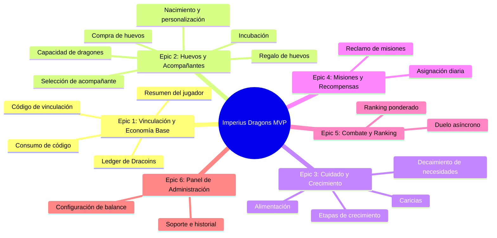

# Imperius Dragons - Product Backlog MVP

> **Estado documental:** backlog conceptual original. Contiene estados, checkboxes y
> numeracion de epicos obsoletos. Consultar [`backlog.md`](backlog.md) para el estado
> verificado contra GitHub Issues y codigo.

Este backlog ha sido diseñado a partir de los documentos técnicos, de contenido y de UX para la implementación del MVP del juego. Está estructurado de forma que cada **User Story** pueda ser copiada y pegada directamente como un **GitHub Issue**, incluyendo su descripción, criterios de aceptación, dependencias, complejidad estimada y tareas técnicas específicas.

---

---

## EPIC 1: Vinculación de Cuenta y Economía Base

### Feature 1.1: Autenticación y Vinculación Roblox-Imperius

#### [US-1.1.1] Generar código de vinculación temporal en Imperius
* **Descripción:** Como alumno autenticado en el portal Imperius, quiero generar un código de vinculación temporal de un solo uso para poder vincular de forma segura mi cuenta en Roblox sin exponer mi contraseña escolar.
* **Criterios de Aceptación:**
  * El código generado debe ser corto (6 caracteres/dígitos) y fácil de leer.
  * El código debe guardarse en base de datos como hash de seguridad (`CodeHash`).
  * El código debe tener un tiempo de expiración estricto de 10 minutos desde su creación.
  * Un alumno solo puede tener un código de vinculación activo a la vez (si solicita uno nuevo, invalida el anterior).
* **Dependencias:** Ninguna (Fase 0/Base de datos configurada).
* **Estimación de Complejidad:** S (Small)
* **Tareas Técnicas:**
  * [ ] Diseñar y crear la tabla `GameLinkCodes` (`Id`, `IdAlumno`, `CodeHash`, `ExpiresAt`, `UsedAt`).
  * [ ] Implementar servicio backend para la generación criptográfica de códigos de 6 caracteres.
  * [ ] Implementar endpoint `POST /api/game/v1/links/code` (protegido por sesión del portal actual).
  * [ ] Registrar fecha de expiración en UTC (`now + 10 min`).

---

#### [US-1.1.2] Consumir código de vinculación en Roblox Studio
* **Descripción:** Como jugador en el cliente de Roblox, quiero introducir el código obtenido en el portal Imperius para que mi cuenta de Roblox quede asociada permanentemente a mi identidad escolar y recibir mis Dracoins iniciales.
* **Criterios de Aceptación:**
  * El servidor de Roblox debe enviar el código introducido y el `RobloxUserId` obtenido mediante API segura de Roblox.
  * El endpoint debe validar que el código existe, no ha sido usado (`UsedAt IS NULL`) y no ha expirado.
  * Al vincular con éxito, se crea el registro inmutable en `GameRobloxLinks`.
  * Se debe garantizar unicidad: un `RobloxUserId` solo puede vincularse a un `IdAlumno` y viceversa.
  * El código se marca como usado en el momento (`UsedAt = now`).
  * Al confirmar la vinculación, se inicia la capacidad del jugador en `GameDragonCapacity` con 1 espacio activo y 10 de límite.
  * El jugador recibe la recompensa de bienvenida de 400 Dracoins (registrado en el ledger).
* **Dependencias:** `[US-1.1.1]`, tabla `GameRobloxLinks`, tabla `GameDragonCapacity`.
* **Estimación de Complejidad:** M (Medium)
* **Tareas Técnicas:**
  * [ ] Diseñar e implementar las tablas `GameRobloxLinks` y `GameDragonCapacity`.
  * [ ] Implementar endpoint `POST /api/game/v1/links/consume` protegido por API Key (`X-Game-Api-Key`).
  * [ ] Implementar validaciones de integridad y unicidad dentro de una transacción SQL.
  * [ ] Crear interfaz de pergamino en Roblox con input de texto de 6 posiciones.
  * [ ] Implementar llamada remota cliente-servidor en Roblox Studio mediante `RemoteFunction` para consumir el endpoint.

---

### Feature 1.2: Economía de Dracoins y Ledger Simple

#### [US-1.2.1] Obtener resumen inicial del jugador (Bootstrap)
* **Descripción:** Como jugador de Roblox, al ingresar al juego, quiero que el sistema cargue mi información de perfil, saldo de Dracoins y dragones disponibles para ver mis datos de forma inmediata.
* **Criterios de Aceptación:**
  * Retorna en una única petición el saldo de Dracoins, la capacidad total, los espacios disponibles, la lista de huevos activos, los dragones no huidos, el dragón seleccionado y la posición del ranking.
  * La llamada debe estar autenticada con la clave del servidor de Roblox y validar que el `RobloxUserId` está activo.
  * Si el usuario no está vinculado, el endpoint retorna un error estructurado `{ code: "NOT_LINKED", message: "..." }`.
* **Dependencias:** `[US-1.1.2]`.
* **Estimación de Complejidad:** S (Small)
* **Tareas Técnicas:**
  * [ ] Implementar endpoint `GET /api/game/v1/players/by-roblox/{robloxUserId}`.
  * [ ] Crear query optimizada que compute los espacios disponibles basándose en la fórmula derivada: `SlotsDisponibles = max(0, CapacidadTotal - (dragones activos + huevos sin abrir))`.
  * [ ] Integrar el llamado al iniciar la sesión del jugador en el servidor de Roblox y almacenar los datos en variables de sesión del script principal.

---

#### [US-1.2.2] Ledger simple de Dracoins e Idempotencia
* **Descripción:** Como sistema de backend, quiero procesar todas las operaciones que alteren Dracoins de forma transaccional e idempotente para evitar duplicaciones o pérdida de saldos por fallos de red.
* **Criterios de Aceptación:**
  * Toda modificación del saldo de Dracoins en `Alumnos.Dracoins` debe realizarse dentro de una transacción SQL.
  * Por cada modificación se debe registrar una fila en `GameDracoinLedger` detallando el monto, saldo resultante, motivo del cambio y el identificador de la operación de referencia.
  * La API debe validar y registrar en `GameIdempotency` la clave única enviada en el header `X-Idempotency-Key`.
  * Si la clave ya fue procesada con éxito, debe retornar el json guardado anteriormente sin volver a ejecutar la transacción.
* **Dependencias:** `[US-1.1.2]`, tabla `Alumnos`, tabla `GameDracoinLedger`, tabla `GameIdempotency`.
* **Estimación de Complejidad:** M (Medium)
* **Tareas Técnicas:**
  * [ ] Crear las tablas `GameDracoinLedger` y `GameIdempotency` con claves primarias y restricciones de unicidad correspondientes.
  * [ ] Implementar Filtro/Middleware de Idempotencia en ASP.NET Core para endpoints de escritura.
  * [ ] Crear `DracoinGameService` centralizado en la API para transacciones de cobros/recompensas.

---

## EPIC 2: Sistema de Huevos y Mascotas Acompañantes

### Feature 2.1: Gestión de Espacios y Capacidad

#### [US-2.1.1] Consultar y comprar capacidad adicional de dragones
* **Descripción:** Como jugador, quiero comprar espacios de almacenamiento adicionales usando Dracoins para poder poseer más huevos y dragones activos simultáneamente.
* **Criterios de Aceptación:**
  * El jugador inicia con 1 espacio base gratuito.
  * El costo del siguiente espacio se calcula como: `PrecioBaseEspacio × (SlotsComprados + 1)`.
  * El límite máximo de capacidad permitida es de 10 espacios totales.
  * La compra debe ser transaccional e idempotente.
  * Se actualiza la cantidad de espacios adquiridos en `GameDragonCapacity.PurchasedSlots`.
* **Dependencias:** `[US-1.2.2]`.
* **Estimación de Complejidad:** S (Small)
* **Tareas Técnicas:**
  * [ ] Implementar endpoint `POST /api/game/v1/players/{robloxUserId}/dragon-capacity/purchase`.
  * [ ] Crear interfaz gráfica de compra de espacios en la tienda de Roblox y conectar con el backend.

---

### Feature 2.2: Adquisición e Incubación de Huevos

#### [US-2.2.1] Comprar huevos del catálogo de la academia
* **Descripción:** Como jugador, quiero comprar un huevo mágico en la tienda con mis Dracoins para ampliar mi colección de dragones.
* **Criterios de Aceptación:**
  * El catálogo de huevos (Hogar, Elemental, Emblema, Arcano) debe consumirse de `GameEggDefinitions`.
  * Valida que el jugador tenga al menos un espacio disponible en su capacidad total antes de proceder.
  * Descuenta el precio del huevo del saldo del alumno y guarda el registro del nuevo huevo en `GameEggs` con estado `Pending`.
  * La operación debe ser transaccional e incluir la idempotencia.
* **Dependencias:** `[US-1.2.2]`, tabla `GameEggDefinitions`, tabla `GameEggs`.
* **Estimación de Complejidad:** M (Medium)
* **Tareas Técnicas:**
  * [ ] Crear las tablas `GameEggDefinitions` y `GameEggs`.
  * [ ] Implementar endpoints `GET /api/game/v1/eggs/catalog` y `POST /api/game/v1/eggs/{eggDefinitionId}/purchase`.
  * [ ] Diseñar el panel de tienda de huevos en Roblox Studio (con confirmación de compra y modal de saldo).

---

#### [US-2.2.2] Iniciar incubación de huevo
* **Descripción:** Como jugador, quiero colocar un huevo en mi pedestal de incubación para iniciar la cuenta regresiva que me permita abrirlo.
* **Criterios de Aceptación:**
  * El huevo debe tener el estado `Pending`.
  * Al iniciar, se calcula `HatchReadyAt = ahora + IncubationMinutes` del catálogo.
  * El estado cambia a `Hatching`.
* **Dependencias:** `[US-2.2.1]`.
* **Estimación de Complejidad:** S (Small)
* **Tareas Técnicas:**
  * [ ] Implementar endpoint `POST /api/game/v1/eggs/{eggId}/incubate`.
  * [ ] Crear script en Roblox para renderizar el huevo sobre el pedestal de incubación y actualizar el contador visual de tiempo restante en tiempo real.

---

#### [US-2.2.3] Nacimiento y personalización de dragón
* **Descripción:** Como jugador, una vez transcurrido el tiempo de incubación del huevo, quiero presenciar su nacimiento para descubrir su rareza, temperamento y colocarle un nombre.
* **Criterios de Aceptación:**
  * Valida que `ahora >= HatchReadyAt`.
  * Se genera un dragón en `GameDragons` heredando la rareza del huevo.
  * Se asigna un temperamento aleatorio desde `GameTemperamentDefinitions` (Noble, Agresivo, Juguetón, Curioso o Perezoso) con sus modificadores de estadísticas (ataque, defensa, necesidades) de hasta `±5%`.
  * Se debe permitir al jugador colocar un nombre al dragón antes de guardarlo en base de datos.
  * El huevo cambia de estado a `Hatched` y guarda el `HatchedDragonId`.
* **Dependencias:** `[US-2.2.2]`, tabla `GameDragons`, tabla `GameTemperamentDefinitions`, tabla `GameDragonDefinitions`.
* **Estimación de Complejidad:** L (Large)
* **Tareas Técnicas:**
  * [ ] Crear las tablas `GameDragons` y `GameDragonDefinitions`.
  * [ ] Implementar endpoint transaccional `POST /api/game/v1/eggs/{eggId}/hatch` que valida el tiempo y recibe el `Name` asignado.
  * [ ] Desarrollar la cinemática de nacimiento en Roblox (rotura de cáscara, partículas con color de rareza e interfaz de revelación).

---

### Feature 2.3: Dragón Acompañante

#### [US-2.3.1] Seleccionar y mostrar dragón acompañante
* **Descripción:** Como jugador, quiero seleccionar a uno de mis dragones nacidos para que me acompañe físicamente por el mapa de la academia.
* **Criterios de Aceptación:**
  * Solo un dragón puede marcarse como `Selected`.
  * El dragón seleccionado no puede estar en estado `Fled` (huido).
  * El modelo 3D del dragón debe instanciarse en Roblox y seguir al avatar del jugador de forma fluida.
* **Dependencias:** `[US-2.2.3]`.
* **Estimación de Complejidad:** M (Medium)
* **Tareas Técnicas:**
  * [ ] Implementar endpoint `POST /api/game/v1/dragons/{dragonId}/select`.
  * [ ] Crear el sistema de seguimiento de mascotas en Roblox (LocalScript y BodyPosition/AlignPosition para el modelo 3D).

---

### Feature 2.4: Regalo de Huevos

#### [US-2.4.1] Regalar huevo a otro jugador
* **Descripción:** Como jugador, quiero regalar un huevo sin abrir a otro miembro de la comunidad mediante su código Imperius para interactuar socialmente.
* **Criterios de Aceptación:**
  * Solo se pueden regalar huevos en estado `Pending` o `Hatching`.
  * No se permite regalarse un huevo a uno mismo.
  * La solicitud de regalo se crea con estado `Pending` en `GameEggTransfers`, bloqueando el huevo para que no sea incubado ni transferido nuevamente.
  * El destinatario debe aceptar el regalo para concretar el cambio de propiedad.
  * Al aceptar, la API valida que el destinatario tenga capacidad de espacio disponible y transfiere la propiedad en una sola transacción SQL.
* **Dependencias:** `[US-2.2.1]`, tabla `GameEggTransfers`.
* **Estimación de Complejidad:** M (Medium)
* **Tareas Técnicas:**
  * [ ] Diseñar la tabla `GameEggTransfers`.
  * [ ] Implementar endpoints `POST /api/game/v1/eggs/{eggId}/gift`, `POST /api/game/v1/egg-gifts/{transferId}/accept` y `/reject`.
  * [ ] Desarrollar en Roblox la interfaz de búsqueda de destinatario, confirmación visual de datos e historial de regalos.

---

## EPIC 3: Cuidado y Crecimiento del Dragón

### Feature 3.1: Actualización de Necesidades y Huida

#### [US-3.1.1] Cálculo bajo demanda del estado y necesidades del dragón
* **Descripción:** Como sistema, quiero calcular el decaimiento de las necesidades del dragón (Hambre, Felicidad, Vida) bajo demanda según el tiempo transcurrido desde su última interacción, para evitar el uso de workers.
* **Criterios de Aceptación:**
  * Las necesidades se calculan secuencialmente y limitan entre 0 y 100:
    * Hambre: Disminuye 1 punto cada 2 horas (`LastNeedsUpdateAt` a `now`).
    * Felicidad: Si hambre < 30, disminuye 1 punto cada 4 horas.
    * Vida: Si felicidad < 20, disminuye 1 punto cada 6 horas.
  * Si la vida llega a 0, el dragón cambia su estado a `Fled` (huido) y se desmarca como seleccionado.
  * El cálculo y guardado en base de datos debe ejecutarse de forma transparente antes de realizar cualquier acción (alimentar, acariciar, combatir, cargar ficha).
* **Dependencias:** `[US-2.2.3]`.
* **Estimación de Complejidad:** M (Medium)
* **Tareas Técnicas:**
  * [ ] Implementar función matemática de decaimiento en la capa de servicios de la API (`DragonService`).
  * [ ] Actualizar base de datos con los estados recalculados y setear `LastNeedsUpdateAt = now`.
  * [ ] Integrar esta lógica como paso previo obligatorio en los endpoints del dragón.

---

### Feature 3.2: Alimentación y Afecto

#### [US-3.2.1] Alimentar al dragón
* **Descripción:** Como jugador, quiero comprar comida y alimentar a mi dragón para recuperar sus niveles de Hambre, Felicidad o Vida.
* **Criterios de Aceptación:**
  * Los alimentos se obtienen y validan desde `GameFoodDefinitions`.
  * El costo de la comida se descuenta inmediatamente del saldo de Dracoins del jugador.
  * La comida recupera los puntos indicados en el catálogo.
  * Si el dragón tiene temperamento *Juguetón*, se aplica un `+5%` a la felicidad obtenida.
  * Toda la operación ocurre en una sola transacción idempotente.
* **Dependencias:** `[US-1.2.2]`, `[US-3.1.1]`, tabla `GameFoodDefinitions`.
* **Estimación de Complejidad:** M (Medium)
* **Tareas Técnicas:**
  * [ ] Diseñar la tabla `GameFoodDefinitions`.
  * [ ] Implementar endpoint `POST /api/game/v1/dragons/{dragonId}/feed/{foodDefinitionId}`.
  * [ ] Crear interfaz del selector de comida en la ficha del dragón dentro de Roblox.

---

#### [US-3.2.2] Acariciar al dragón
* **Descripción:** Como jugador, quiero acariciar a mi dragón de forma gratuita para aumentar su felicidad y fortalecer nuestro vínculo.
* **Criterios de Aceptación:**
  * La acción es gratuita y tiene un cooldown de 4 horas por jugador.
  * Aumenta la felicidad del dragón en +6 puntos.
  * Otorga un 15% de probabilidad de ganar +3 XP para el dragón.
  * El dragón debe responder con un texto descriptivo e interactivo en pantalla basado en su temperamento.
  * Considerar bono de Hufflepuff: `+5%` de felicidad obtenida.
* **Dependencias:** `[US-2.3.1]`, `[US-3.1.1]`.
* **Estimación de Complejidad:** S (Small)
* **Tareas Técnicas:**
  * [ ] Implementar lógica de cooldown basada en base de datos.
  * [ ] Crear endpoint `POST /api/game/v1/dragons/{dragonId}/pet`.
  * [ ] Diseñar la animación de caricia y el bocadillo de diálogo en Roblox Studio según el temperamento asignado.

---

### Feature 3.3: Progreso y Crecimiento

#### [US-3.3.1] Crecimiento y etapas del dragón
* **Descripción:** Como jugador, quiero que mi dragón suba de nivel y evolucione de etapa física al cumplir los requisitos necesarios para verlo más fuerte e imponente.
* **Criterios de Aceptación:**
  * El nivel máximo del dragón en el MVP es 20. Cada nivel superior al 1 incrementa las estadísticas base (Vida, Ataque, Defensa) en `+2%`.
  * Etapas de crecimiento:
    * *Bebé → Joven:* Requiere mínimo 24 horas de vida, 80 XP, Vida >= 50, Felicidad >= 30.
    * *Joven → Adulto:* Requiere mínimo 72 horas en etapa Joven, 250 XP total, Vida >= 60, Felicidad >= 40.
  * Al subir de etapa se escala el tamaño del modelo 3D y se altera el multiplicador de daño en combate.
* **Dependencias:** `[US-3.1.1]`.
* **Estimación de Complejidad:** M (Medium)
* **Tareas Técnicas:**
  * [ ] Crear lógica de subida de nivel y etapas en la API.
  * [ ] Implementar escalado visual en los scripts de Roblox según la propiedad `Stage` y `Level` del dragón.

---

## EPIC 4: Loop de Misiones y Recompensas

### Feature 4.1: Asignación y Reclamo de Misiones

#### [US-4.1.1] Asignación diaria de misiones
* **Descripción:** Como jugador, quiero que la academia me asigne 3 misiones de forma diaria al ingresar al juego para tener retos y ganar recompensas.
* **Criterios de Aceptación:**
  * Al primer ingreso del día (basado en fecha UTC), la API crea 3 misiones para el jugador a partir de las definiciones activas en `GameMissionDefinitions`.
  * El progreso de las misiones se actualiza de forma automática en backend en la misma transacción que origina la acción (ej: comprar alimento suma progreso a misión de alimentar).
  * Retorna la lista en `GET /api/game/v1/players/{robloxUserId}/missions`.
* **Dependencias:** `[US-1.1.2]`, tabla `GameMissionDefinitions`, tabla `GamePlayerMissions`.
* **Estimación de Complejidad:** M (Medium)
* **Tareas Técnicas:**
  * [ ] Crear tablas `GameMissionDefinitions` y `GamePlayerMissions`.
  * [ ] Implementar servicio backend para la asignación y reinicio diario de misiones.
  * [ ] Diseñar interfaz gráfica del diario de misiones en Roblox.

---

#### [US-4.1.2] Reclamar recompensas de misiones completadas
* **Descripción:** Como jugador, quiero reclamar de manera manual mis misiones completadas para sumar Dracoins y experiencia a mi dragón acompañante.
* **Criterios de Aceptación:**
  * Valida que la misión esté en estado completo y no haya sido reclamada previamente.
  * Suma Dracoins y XP de forma idempotente.
  * Aplica bono de casa Ravenclaw: `+5%` de experiencia al reclamar misiones.
  * Cambia el estado de la misión a `Claimed` y registra la fecha.
* **Dependencias:** `[US-1.2.2]`, `[US-4.1.1]`.
* **Estimación de Complejidad:** S (Small)
* **Tareas Técnicas:**
  * [ ] Crear endpoint `POST /api/game/v1/missions/{playerMissionId}/claim`.
  * [ ] Implementar animaciones de monedas y texto de recompensa en la UI de Roblox al reclamar con éxito.

---

## EPIC 5: Sistema de Combates Automáticos y Ranking

### Feature 5.1: Simulación de Combates Asíncronos 1vs1

#### [US-5.1.1] Simular duelo automático 1vs1
* **Descripción:** Como jugador, quiero enviar a mi dragón seleccionado a combatir en duelos automáticos asíncronos contra dragones de otros jugadores (o dragones salvajes) para ganar puntos de ranking y recompensas.
* **Criterios de Aceptación:**
  * El oponente se selecciona de manera asíncrona (se elige el dragón seleccionado de un jugador con nivel similar, o bien una plantilla de dragón salvaje desde `GameWildDragonDefinitions`).
  * Los dragones en estado `Fled` o con Vida crítica no pueden combatir.
  * El combate ocurre en backend en un ciclo de máximo 10 rondas usando la fórmula: `daño = max(1, ataque_atacante - defensa_defensor / 2 + variacion[-2, 2])`.
  * Aplica multiplicadores elementales (±15% daño) y etapa física.
  * Guarda la instantánea del oponente y el log de rondas en `GameBattles.OpponentSnapshotJson`.
  * Entrega recompensas en base al resultado: los primeros 5 duelos diarios otorgan Dracoins; los siguientes solo XP.
  * Se aplica bono Slytherin: `+5%` Dracoins en los primeros 5 combates, con un tope de +5 DC diarios.
* **Dependencias:** `[US-1.2.2]`, `[US-3.1.1]`, tabla `GameBattles`, tabla `GameWildDragonDefinitions`.
* **Estimación de Complejidad:** L (Large)
* **Tareas Técnicas:**
  * [ ] Crear tablas `GameBattles` y `GameWildDragonDefinitions`.
  * [ ] Implementar motor matemático de simulación de rondas en backend (`BattleService`).
  * [ ] Crear endpoint `POST /api/game/v1/battles/automatic`.
  * [ ] Desarrollar en Roblox Studio la escena de la arena de duelo, reproduciendo el registro de rondas de forma visual.

---

### Feature 5.2: Ranking Ponderado

#### [US-5.2.1] Mostrar ranking de cuidadores de la academia
* **Descripción:** Como jugador, quiero ver el tablero del ranking comunitario para conocer las puntuaciones más altas y comparar mi posición.
* **Criterios de Aceptación:**
  * El ranking muestra los 50 mejores jugadores y una tarjeta persistente con la puntuación y posición del jugador logueado.
  * El puntaje se calcula agrupando el historial de `GameBattles` aplicando las reglas: Victoria = Valor del rival, Empate = 40% del valor del rival (redondeado hacia arriba), Derrota = 0.
  * El valor del rival es: `max(1, 5 + ModificadorNivel + BonusRareza)`.
  * Los combates contra dragones salvajes otorgan 0 puntos de ranking.
* **Dependencias:** `[US-5.1.1]`.
* **Estimación de Complejidad:** M (Medium)
* **Tareas Técnicas:**
  * [ ] Diseñar query SQL que calcule en tiempo real los puntajes agrupando batallas elegibles (sin tablas duplicadas para optimizar el rendimiento).
  * [ ] Implementar endpoint `GET /api/game/v1/ranking?limit=50`.
  * [ ] Crear panel de Ranking en Roblox Studio.

---

## EPIC 6: Panel de Administración y Soporte

### Feature 6.1: Configuración de Balance y Soporte Técnico

#### [US-6.1.1] Ajustes de balance en caliente
* **Descripción:** Como administrador de la academia, quiero modificar los valores de balance, precios y misiones desde un panel de control para ajustar el juego sin tener que realizar redespliegues del backend.
* **Criterios de Aceptación:**
  * El panel administrativo debe consumir endpoints protegidos por la autenticación del portal actual de Imperius.
  * Permite modificar registros en tablas de catálogos (`GameSettings`, `GameEggDefinitions`, `GameFoodDefinitions`, `GameMissionDefinitions`).
  * Las modificaciones deben tener validaciones lógicas estrictas (por ejemplo: los modificadores de temperamento deben mantenerse estrictamente en el rango de `-5%` y `+5%`).
* **Dependencias:** Base de datos y API del MVP funcionando.
* **Estimación de Complejidad:** M (Medium)
* **Tareas Técnicas:**
  * [ ] Crear endpoints administrativos `/api/game/v1/admin/game/...` protegidos por roles.
  * [ ] Implementar validaciones específicas para coeficientes económicos y de temperamentos en backend.
  * [ ] Crear pantallas de mantenimiento dentro del portal administrativo Angular existente.

---

#### [US-6.1.2] Soporte e historial de jugadores
* **Descripción:** Como administrador, quiero buscar a un jugador específico para auditar sus transacciones financieras, consultar su inventario de dragones y restaurar una mascota huida.
* **Criterios de Aceptación:**
  * Permite buscar por `IdAlumno` o `RobloxUserId`.
  * Muestra el saldo actual, el listado de huevos e historial del ledger de Dracoins.
  * Permite realizar ajustes manuales de Dracoins con un campo obligatorio de justificación que se guardará en el ledger.
  * Permite la restauración manual de dragones con estado `Fled` para devolverlos al inventario del jugador.
* **Dependencias:** `[US-6.1.1]`.
* **Estimación de Complejidad:** M (Medium)
* **Tareas Técnicas:**
  * [ ] Implementar endpoint `GET /api/game/v1/admin/game/players/{idAlumno}`.
  * [ ] Implementar endpoints `POST /api/game/v1/admin/game/dracoins/adjustment` y `POST /api/game/v1/admin/game/dragons/{dragonId}/restore`.
  * [ ] Diseñar e integrar vistas de auditoría y soporte en la interfaz Angular.
