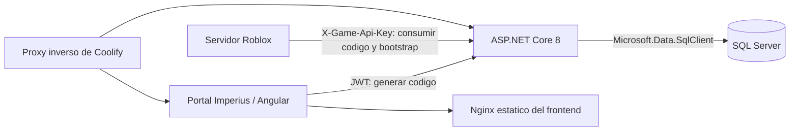

# Arquitectura Actual

Ultima auditoria: **9 de junio de 2026**

## Alcance implementado

La arquitectura Game implementada cubre la vinculacion de cuenta, la infraestructura
economica usada por esa vinculacion, la lectura bootstrap y persistencia minima de
huevos.



## Componentes reales

| Componente | Estado | Responsabilidad actual |
|---|---|---|
| Angular | Existente | Portal Imperius; no incluye aun interfaz Game confirmada en este repositorio. |
| Nginx frontend | Existente | Sirve Angular y hace fallback a `index.html`; no proxyfica `/api`. |
| ASP.NET Core 8 | Implementado | Aloja portal API y modulo Game en un solo monolito. |
| SQL Server | Produccion | Aloja cinco tablas Game; `GameEggs` espera aplicar migracion. |
| Coolify | Produccion | Publica frontend y API bajo dominios separados. |
| Roblox Studio | Fuera del repositorio | Consume la API desde scripts de servidor. |

## Modulo Game

El modulo vive dentro de:

```text
ImperiusDraconisAPI/ImperiusDraconisAPI/
├── Configuration/GameOptions.cs
├── Controllers/Game/GameLinksController.cs
├── Models/Game/
├── Security/GameApiKeyAuthentication*.cs
└── Services/Game/
```

No existe un proyecto Core separado, microservicio Game, Redis, Worker, cola ni
Entity Framework.

## Autenticacion

| Flujo | Esquema |
|---|---|
| Portal → generar codigo | JWT Bearer existente |
| Servidor Roblox → consumir codigo | `X-Game-Api-Key` mediante esquema `GameApiKey` |

El endpoint de consumo exige ademas `X-Idempotency-Key`.

## Configuracion Game real

| Variable | Uso |
|---|---|
| `Game__Version` | Version del contrato bootstrap; valor esperado `1.0.0` |
| `Game__ApiKey` | Autenticar servidor Roblox |
| `Game__LinkCodePepper` | HMAC-SHA256 de codigos |
| `Game__LinkCodeExpirationMinutes` | Expiracion; valor esperado `10` |
| `Game__WelcomeDracoins` | Recompensa inicial; valor esperado `400` |
| `Game__BaseDragonSlots` | Capacidad base; debe ser `1` |
| `Game__MaxDragonCapacity` | Capacidad maxima; entre `1` y `10` |

## Flujo implementado

### Generacion

1. JWT identifica `IdAlumno`.
2. Se revoca cualquier codigo pendiente anterior.
3. Se valida alumno activo y sin vinculo.
4. Se genera codigo legible de ocho caracteres.
5. Solo se guarda HMAC-SHA256.

### Consumo

En una transaccion SQL serializable:

1. Reserva idempotencia `GAME_LINK_CONSUME`.
2. Valida codigo y jugador.
3. Crea `GameRobloxLinks`.
4. Crea `GameDragonCapacity`.
5. Acredita Dracoins y crea `GameDracoinLedger`.
6. Marca codigo usado.
7. Guarda respuesta idempotente.
8. Confirma la transaccion.

### Bootstrap

1. El servidor Roblox se autentica con `X-Game-Api-Key`.
2. Se busca el vínculo activo por `RobloxUserId`.
3. Se obtiene perfil, casa, saldo y capacidad.
4. Se consultan huevos mediante `GameEggService`.
5. Se devuelve el contrato versionado y se calcula capacidad disponible.

### Persistencia de huevos

- `GameEggService` contiene CRUD interno; no existe controlador publico de huevos.
- Crear valida alumno activo y capacidad dentro de una transaccion serializable.
- El estado listo se deriva al leer un `INCUBATING` vencido, sin Redis ni Worker.
- Eclosion, compra, regalos y dragones no estan implementados.

## Despliegue y routing

- `https://beta.imperiusdraconis.lat`: Angular/Nginx.
- `https://api-beta.imperiusdraconis.lat`: ASP.NET Core/Kestrel.
- El Nginx del frontend no contiene `proxy_pass`.
- Las llamadas API deben usar el dominio `api-beta`.

## Limitaciones actuales

- Swagger solo se habilita en `Development`.
- No hay pruebas de integracion SQL automatizadas.
- Bootstrap implementado localmente, pendiente de despliegue y prueba en produccion.
- `DracoinGameService` solo soporta la recompensa `WELCOME_LINK`.
- `GameIdempotencyService` existe, pero no es middleware general.
- El ledger Game no registra movimientos realizados por servicios heredados.
