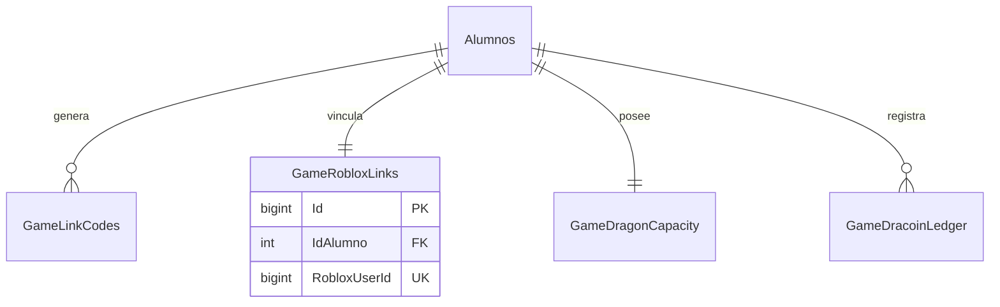

# Base de Datos Game

Ultima auditoria: **9 de junio de 2026**

## Fuente verificada

- Migracion: `SQLMigrar/003_create_game_epic1.sql`
- Estado informado: aplicada correctamente en produccion.
- ORM: ninguno; acceso mediante `Microsoft.Data.SqlClient`.

No se consulto directamente el catalogo de produccion durante esta auditoria. La
estructura documentada corresponde a la migracion aplicada y al codigo desplegado.

## Relaciones



`GameIdempotency` no posee FK: identifica operaciones HTTP por `Operation` e
`IdempotencyKey`.

## Tablas existentes

### `GameLinkCodes`

Guarda codigos temporales únicamente como `CodeHash BINARY(32)`.

Campos: `Id`, `IdAlumno`, `CodeHash`, `ExpiresAt`, `UsedAt`, `RevokedAt`, `CreatedAt`.

Restricciones clave:

- FK a `Alumnos.IdAlumno`.
- Un solo codigo pendiente por alumno.
- Un solo hash pendiente.
- Un codigo no puede quedar usado y revocado simultaneamente.
- Fechas de uso/revocacion no pueden preceder la creacion.

### `GameRobloxLinks`

Vinculo permanente entre alumno y Roblox.

Campos: `Id`, `IdAlumno`, `RobloxUserId`, `LinkedAt`, `Active`, `UnlinkedAt`.

Restricciones clave:

- `IdAlumno` unico.
- `RobloxUserId` unico y mayor a cero.
- FK a `Alumnos`.
- Estado activo exige `UnlinkedAt IS NULL`.

Aunque existe estado de desvinculacion, no hay endpoint de desvinculacion.

### `GameDragonCapacity`

Capacidad inicial creada al vincular.

Campos: `IdAlumno`, `PurchasedSlots`, `MaxCapacity`, `UpdatedAt`, `RowVersion`.

Restricciones clave:

- PK/FK `IdAlumno`.
- `PurchasedSlots <= 9`.
- `MaxCapacity BETWEEN 1 AND 10`.
- `1 + PurchasedSlots <= MaxCapacity`.

La capacidad total es derivada:

```text
TotalSlots = 1 + PurchasedSlots
```

### `GameDracoinLedger`

Ledger inmutable de operaciones economicas Game.

Campos: `Id`, `IdAlumno`, `Amount`, `BalanceAfter`, `Reason`, `ReferenceType`,
`ReferenceId`, `CreatedAt`.

Restricciones clave:

- Montos y saldos deben ser enteros aunque sean `decimal(18,2)`.
- `Amount <> 0`.
- `BalanceAfter >= 0`.
- Una sola fila `WELCOME_LINK` por alumno mediante indice unico filtrado.

Actualmente solo registra:

```text
Reason = WELCOME_LINK
ReferenceType = ROBLOX_LINK
```

### `GameIdempotency`

Guarda reserva y respuesta de operaciones repetibles.

Campos: `Id`, `Operation`, `IdempotencyKey`, `RequestHash`, `Status`,
`ResponseStatusCode`, `ResponseJson`, `CreatedAt`, `CompletedAt`, `ExpiresAt`.

Restricciones clave:

- Unico `Operation + IdempotencyKey`.
- Estados permitidos: `Pending`, `Completed`.
- Respuesta obligatoria cuando esta completado.
- `ResponseJson` debe ser JSON valido.

Actualmente solo se usa la operacion:

```text
GAME_LINK_CONSUME
```

## Flujo transaccional de consumo

Todas estas escrituras ocurren en una sola transaccion:

```text
GameIdempotency Pending
→ GameRobloxLinks
→ GameDragonCapacity
→ Alumnos.Dracoins
→ GameDracoinLedger
→ GameLinkCodes.UsedAt
→ GameIdempotency Completed
```

Un fallo produce rollback completo.

## Tablas no existentes

No existen tablas Game para:

- Huevos o catalogo de huevos.
- Dragones o temperamentos.
- Misiones.
- Combates o dragones salvajes.
- Ranking.
- Configuracion administrativa Game.

